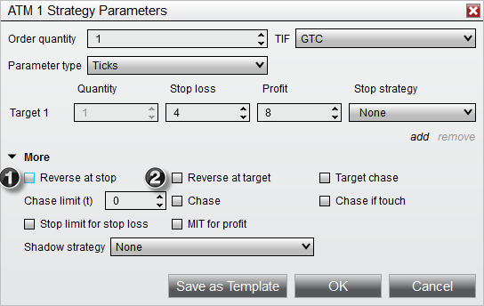
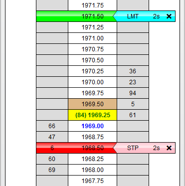
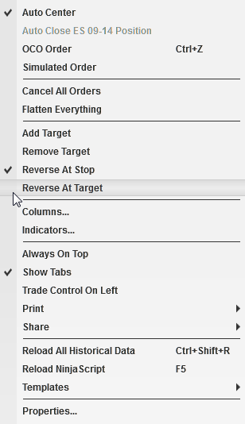



Operations \> Advanced Trade Management (ATM) \> ATM Strategy \> Advanced Options \> Auto Reverse

Auto Reverse

| \<\< [Click to Display Table of Contents](auto_reverse.md) \>\> **Navigation:**     [Operations](operations-1.md) \> [Advanced Trade Management (ATM)](advanced_trade_management_atm-1.md) \> [ATM Strategy](atm_strategy-1.md) \> [Advanced Options](advanced_options-1.md) \> Auto Reverse | [Previous page](auto_chase-1.md) [Return to chapter overview](advanced_options-1.md) [Next page](shadow_strategy-1.md) |
| --- | --- |

Auto Reverse simply reverses your position at either your Stop Loss or Profit Target. You can optionally enable (1\) "Reverse at stop" or (2\) "Reverse at target" with any ATM Strategy. The reverse ATM Strategy used will be the same as the position ATM Strategy you are reversing from.

 

 

When Auto Reverse is enabled, entry orders for the reverse ATM Strategy will be placed at either your Stop Loss or Profit Target orders. The image  below shows a 1 stop/1 target ATM Strategy with Auto Reverse  enabled for both the stop and target.

 

 

Modifying the price of either your Stop Loss or Profit Target will result in the modification of the reverse order as well. You can also enable or disable Auto Reverse of an active ATM Strategy at any time by selecting the "Reverse At Stop" or "Reverse At Target" menus via the right mouse click context menu in either the SuperDOM or Basic Entry windows.

 

