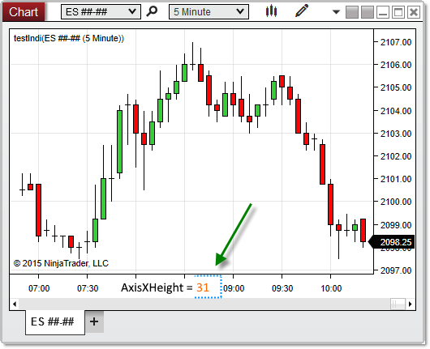


NinjaScript \> Language Reference \> Common \> Charts \> ChartControl \> AxisXHeight
AxisXHeight
| \<\< [Click to Display Table of Contents](axisxheight.md) \>\> **Navigation:**     [NinjaScript](ninjascript.md) \> [Language Reference](language_reference_wip.md) \> [Common](common.md) \> [Charts](chart.md) \> [ChartControl](chartcontrol.md) \> AxisXHeight | [Previous page](chartcontrol.md) [Return to chapter overview](chartcontrol.md) [Next page](axisyleftwidth.md) |
| --- | --- |
## Definition
Measures the distance (in pixels) between the x\-axis and the top of the horizontal scroll bar near the bottom of the chart.
## 
## Property Value
A double representing the number of pixels separating the x\-axis and the top of the horizontal scroll bar on the chart.
## 
## Syntax
\<ChartControl\>.AxisXHeight
## 
## Example
| ns |
| --- |
| protected override void OnRender(ChartControl chartControl, ChartScale chartScale) {      // Print the number of pixels between the x\-axis and the top of the horizontal scrollbar      double height \= chartControl.AxisXHeight;      Print(height); } |

Based on the image below, AxisXHeight reveals that the space between the x\-axis and the top of the horizontal scrollbar is 31 pixels on this chart.
 

