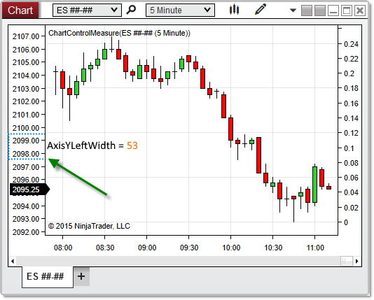


NinjaScript > Language Reference > Common > Charts > ChartControl > AxisYLeftWidth

AxisYLeftWidth
| << [Click to Display Table of Contents](axisyleftwidth.md) >> **Navigation:**     [NinjaScript](ninjascript-1.md) > [Language Reference](language_reference_wip-1.md) > [Common](common-1.md) > [Charts](chart-1.md) > [ChartControl](chartcontrol-1.md) > AxisYLeftWidth | [Previous page](axisxheight-1.md) [Return to chapter overview](chartcontrol-1.md) [Next page](axisyrightwidth-1.md) |
| --- | --- |
## Definition
Measures the distance (in pixels) between the y-axis and the left edge of a chart.
## 
## Property Value
 A double representing the number of pixels separating the y-axis and the left edge of the chart.
## 
## Syntax
 <ChartControl>.AxisYLeftWidth
## 
## Example
| ns |
| --- |
| protected override void OnRender(ChartControl chartControl, ChartScale chartScale) {      // Print the number of pixels between the y-axis and the left edge of the chart      double leftWidth = chartControl.AxisYLeftWidth;      Print(leftWidth); } |

Based on the image below, AxisYLeftWidth reveals that the space between the y-axis and the left edge of the chart is 53 pixels on this chart.
 

 
| Note: When there are no left-justified data series on a chart, AxisYLeftWidth will return 0, as there will be no space between the y-axis and the left margin. |
| --- |
