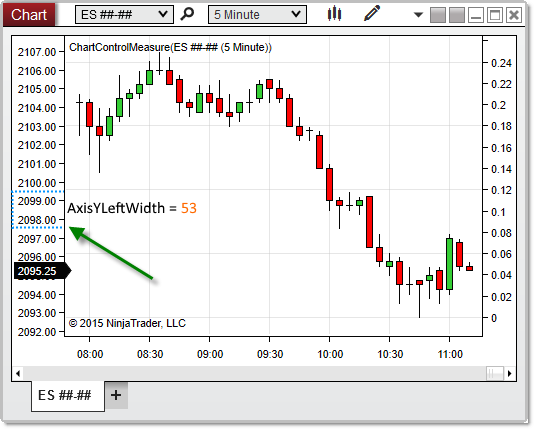



NinjaScript \> Language Reference \> Common \> Charts \> ChartControl \> AxisYLeftWidth

AxisYLeftWidth

| \<\< [Click to Display Table of Contents](axisyleftwidth.md) \>\> **Navigation:**     [NinjaScript](ninjascript.md) \> [Language Reference](language_reference_wip.md) \> [Common](common.md) \> [Charts](chart.md) \> [ChartControl](chartcontrol.md) \> AxisYLeftWidth | [Previous page](axisxheight.md) [Return to chapter overview](chartcontrol.md) [Next page](axisyrightwidth.md) |
| --- | --- |

## Definition

Measures the distance (in pixels) between the y\-axis and the left edge of a chart.

## 

## Property Value

 A double representing the number of pixels separating the y\-axis and the left edge of the chart.

## 

## Syntax

 \<ChartControl\>.AxisYLeftWidth

## 

## Example

| ns |
| --- |
| protected override void OnRender(ChartControl chartControl, ChartScale chartScale) {      // Print the number of pixels between the y\-axis and the left edge of the chart      double leftWidth \= chartControl.AxisYLeftWidth;      Print(leftWidth); } |

 

 

Based on the image below, AxisYLeftWidth reveals that the space between the y\-axis and the left edge of the chart is 53 pixels on this chart.

 

 

| Note: When there are no left\-justified data series on a chart, AxisYLeftWidth will return 0, as there will be no space between the y\-axis and the left margin. |
| --- |

