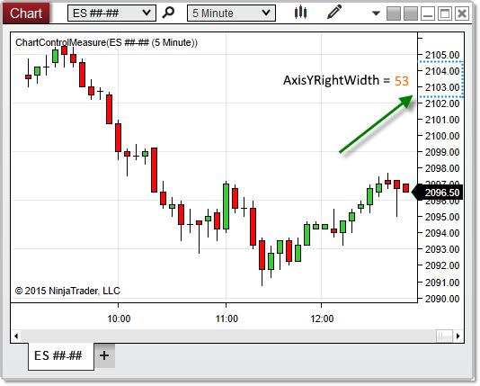



NinjaScript \> Language Reference \> Common \> Charts \> ChartControl \> AxisYRightWidth

AxisYRightWidth

| \<\< [Click to Display Table of Contents](axisyrightwidth.md) \>\> **Navigation:**     [NinjaScript](ninjascript-1.md) \> [Language Reference](language_reference_wip-1.md) \> [Common](common-1.md) \> [Charts](chart-1.md) \> [ChartControl](chartcontrol-1.md) \> AxisYRightWidth | [Previous page](axisyleftwidth-1.md) [Return to chapter overview](chartcontrol-1.md) [Next page](barmarginleft-1.md) |
| --- | --- |

## Definition

Measures the distance (in pixels) between the y\-axis and the right edge of a chart.

## 

## Property Value

 A double representing the number of pixels separating the y\-axis and the right edge of the chart.

## 

## Syntax

 \<ChartControl\>.AxisYRightWidth

## 

## Example

| ns |
| --- |
| protected override void OnRender(ChartControl chartControl, ChartScale chartScale) {      // Print the number of pixels between the y\-axis and the right edge of the chart      double rightWidth \= chartControl.AxisYRightWidth;      Print(rightWidth); } |

 

 

Based on the image below, AxisYRightWidth reveals that the space between the y\-axis and the right edge of the chart is 53 pixels on this chart.

 

 

| Note: When there are no right\-justified data series on a chart, AxisYRightWidth will return 0, as there will be no space between the y\-axis and the right edge. |
| --- |

