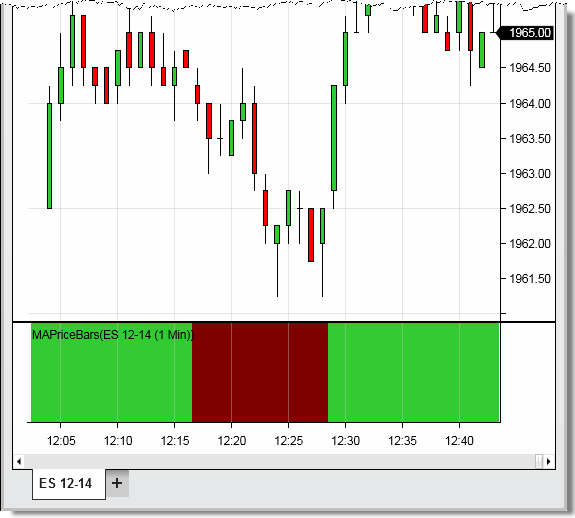

NinjaScript \> Language Reference \> Common \> Drawing \> BackBrush

BackBrush

| \<\< [Click to Display Table of Contents](backbrush.md) \>\> **Navigation:**     [NinjaScript](ninjascript-1.md) \> [Language Reference](language_reference_wip-1.md) \> [Common](common-1.md) \> [Drawing](drawing-1.md) \> BackBrush | [Previous page](allowremovalofdrawobjects-1.md) [Return to chapter overview](drawing-1.md) [Next page](backbrushall-1.md) |
| --- | --- |

## Definition

Sets the brush used for painting the chart panel's background color for the current bar.

 

| Note: This property will only set the back color for the panel the indicator is running.  To set background color for all panels, please see the [BackBrushAll](backbrushall-1.md) property. |
| --- |

 

## Property Value

A [Brush](http://msdn.microsoft.com/en-us/library/system.windows.media.brush(v=vs.110).aspx) object that represents the color of the current chart bar.

 

## Syntax

BackBrush

 

| Warning:  You may have up to 65,535 unique BackBrush instances, therefore, using [static predefined brushes](working_with_brushes-1.md) should be favored.  Alternatively,  in order to use fewer brushes, please try to cache your custom brushes until a new brush would actually need to be created. |
| --- |

## 

## 

## Examples

| ns |
| --- |
| protected override void OnBarUpdate() {      // Sets the chart panel back color to pale green      BackBrush \= Brushes.PaleGreen;        // Sets the back color to to null which will use the default color set in the chart properties dialog window      BackBrush \= null;        // Sets the back color to maroon when the closing price is less than the 20 period SMA // and to lime green when above (see image below)      BackBrush \= SMA(20)\[0] \>\= Close\[0] ? Brushes.Maroon : Brushes.LimeGreen; } |

 

 

