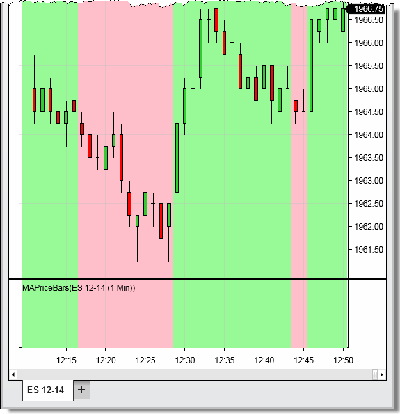

NinjaScript \> Language Reference \> Common \> Drawing \> BackBrushAll
BackBrushAll
| \<\< [Click to Display Table of Contents](backbrushall.md) \>\> **Navigation:**     [NinjaScript](ninjascript.md) \> [Language Reference](language_reference_wip.md) \> [Common](common.md) \> [Drawing](drawing.md) \> BackBrushAll | [Previous page](backbrush.md) [Return to chapter overview](drawing.md) [Next page](backbrushes.md) |
| --- | --- |
## Definition
A collection of prior back brushes used for the background colors for all chart panels.
 
## Property Value
A [Brush](http://msdn.microsoft.com/en-us/library/system.windows.media.brush(v=vs.110).aspx) object that represents the color of the current chart bar.
 
| Tip:  To reset the Chart background color to the default background color property, set the BackBrushAll to null for that bar. |
| --- |

 
## Syntax
BackBrushAll
 
| Warning:  You may have up to 65,535 unique BackBrushAll instances, therefore, using [static predefined brushes](working_with_brushes.md) should be favored.  Alternatively,  in order to use fewer brushes, please try to cache your custom brushes until a new brush would actually need to be created. |
| --- |

## 
## 
## Examples
| ns |
| --- |
| protected override void OnBarUpdate() {      // Sets the back color to pale green      BackBrushAll \= Brushes.PaleGreen;        // Sets the back color to null to use the default color set in the chart properties dialog window      BackBrushAll \= null;        // Sets the back color to pink when the closing price is less than the 20 period SMA      // and to lime green when above (see image below)      BackBrushAll \= SMA(20)\[0] \>\= Close\[0] ? Brushes.Pink : Brushes.PaleGreen; } |

