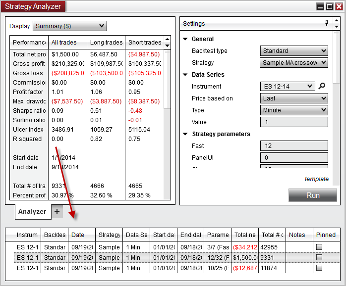


Operations > Strategy Analyzer > Understanding Backtest Logs

Understanding Strategy Analyzer Logs

| << [Click to Display Table of Contents](backtest_logs.md) >> **Navigation:**     [Operations](operations.md) > [Strategy Analyzer](strategy_analyzer.md) > Understanding Strategy Analyzer Logs | [Previous page](basket_test.md) [Return to chapter overview](strategy_analyzer.md) [Next page](reviewing_performance_results.md) |
| --- | --- |
The Strategy analyzer saves a log on each backtest. The logs can be seen by right clicking on the Strategy Analyzer and selecting "Show Logs". Logs offer a convenient way to keep a history of backtest results. They can be used as you work to develop a strategy and fine tune parameters and code to compare previous backtests to current backtests easily. 
 
The log also contains a saved snapshot version of the code used for the backtest, making it possible to look at or revert to previous code used. 
 

| Note: Code save functionality only works on open and unlocked NinjaScript Strategies.   Strategies which are protected by the vendor cannot be used to save code. |
| --- |
 

 

| Understanding Logs NinjaTrader saves a log each time you perform a backtest in the strategyt analyzer. It saves several key information in the log which makes it easier to iterate on a strategy over time.    The log saves the following information per test:     | Instrument | The instrument the test was performed on. | | --- | --- | | Backtest | The type of backtest that was performed | | Date | The date the backtest was performed | | Strategy | The strategy used for the backtest | | Data Series | The data series used for the backtest | | Start date | The start date used for the backtest | | End date | The end date used for the backtest | | Parameters | The parameters used for the backtest | | Total net profit | The total net profit for the backtest | | Notes | An optional field to add user defined notes to more accurately recall the test. Double click the field to begin editing and when complete press enter on the keyboard to set the note. | | Pinned | An optional field to Pin a result  to the top. Pinned results are useful for saving a specific backtest of note for reference later. | |
| --- | --- | --- | --- | --- | --- | --- | --- | --- | --- | --- | --- | --- | --- | --- | --- | --- | --- | --- | --- | --- | --- | --- |

| Using Logs Logs are integrated with the Strategy Analyzer and can be double clicked to quickly restore the parameters and backtest information for that backtest. Giving you freedom to experiment with different configurations while maintaining the ability to compare previous backtests and restore a previous backtest at any time.   Right clicking on a backtest log yields the following context menu:   StrategyAnalyzer_RightClickMenu     | Open In Strategy Analyzer Tab | Opens the backtest in a new tab in the current Strategy Analyzer window | | --- | --- | | Open in New Strategy Analyzer | Opens the backtest in a new Strategy Analyzer | | Open in NinjaScript Editor | Opens the saves revision of the code as used when the backtest was run. You can restore any set of backtest | | Remove | Removes the selected backtest log | | Remove All Non-Pinned | Removes all backtest logs that are not pinned. | | Filter By Strategy | Only view backtest logs for a specific strategy | | Filter By Instrument | Only view backtest logs for a specific instrument | | Filter By Date | Only view backtest logs for a specific date range | |
| --- | --- | --- | --- | --- | --- | --- | --- | --- | --- | --- | --- | --- | --- | --- | --- | --- |

