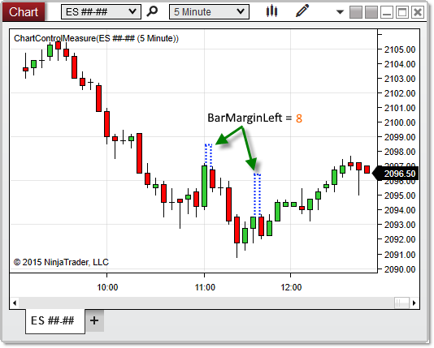


NinjaScript \> Language Reference \> Common \> Charts \> ChartControl \> BarMarginLeft
BarMarginLeft
| \<\< [Click to Display Table of Contents](barmarginleft.md) \>\> **Navigation:**     [NinjaScript](ninjascript.md) \> [Language Reference](language_reference_wip.md) \> [Common](common.md) \> [Charts](chart.md) \> [ChartControl](chartcontrol.md) \> BarMarginLeft | [Previous page](axisyrightwidth.md) [Return to chapter overview](chartcontrol.md) [Next page](chartcontrol_barsarray.md) |
| --- | --- |
## Definition
A hard\-coded minimum bar margin value, set to 8 pixels, which can be used as a base value when creating custom Chart Styles.
## 
## Property Value
A value representing the minimum margin applied to the left edge of bars. This value is hard\-coded to 8 pixels, and it can be used as a base value when setting the bar margin in custom [Chart Styles](chart_style.md).
## 
## Syntax
\<ChartControl\>.BarMarginLeft
## 
## Example
| ns |
| --- |
| protected override void OnRender(ChartControl chartControl, ChartScale chartScale) {      // Print the number of pixels maintained as a margin to the left of bars      double barMargin \= chartControl.BarMarginLeft;      Print(barMargin); } |

Based on the image below, BarMarginLeft reveals that the minimum margin maintained to the left of each bar is 8 pixels on this chart.
 

