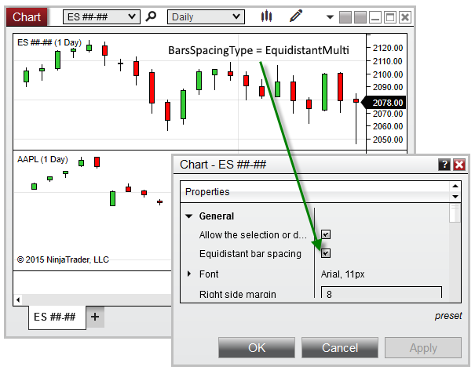



NinjaScript \> Language Reference \> Common \> Charts \> ChartControl \> BarSpacingType

BarSpacingType

| \<\< [Click to Display Table of Contents](barspacingtype.md) \>\> **Navigation:**     [NinjaScript](ninjascript-1.md) \> [Language Reference](language_reference_wip-1.md) \> [Common](common-1.md) \> [Charts](chart-1.md) \> [ChartControl](chartcontrol-1.md) \> BarSpacingType | [Previous page](chartcontrol_barsarray-1.md) [Return to chapter overview](chartcontrol-1.md) [Next page](chartcontrol_barsperiod-1.md) |
| --- | --- |

## Definition

Indicates the type of bar spacing used for the primary [Bars](bars-1.md) object on the chart.

## 

## Property Value

An enum representing one of the values below:

 

| EquidistantSingle | Indicates Equidistant Bar Spacing is used, and only one Bars object exists on the chart |
| --- | --- |
| EquidistantMulti | Indicates Equidistant Bar Spacing is used, and more than one Bars objects exist on the chart |
| TimeBased | Indicates Time\-Based bar spacing is used |

## 

## 

## Syntax

\<ChartControl\>.BarSpacingType

## 

## Example

| ns |
| --- |
| protected override void OnRender(ChartControl chartControl, ChartScale chartScale) {    // Print the type of bar spacing used on the chart    Print(chartControl.BarSpacingType); } |

 

 

Based on the image below, BarSpacingType confirms that there are multiple Bars objects configured on the chart, and that the chart is set to Equidistant Bar Spacing:

 

