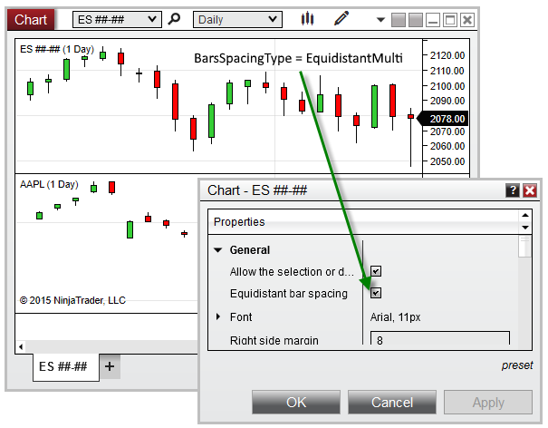



BarSpacingType

|  |  |
| --- | --- |
| << [Click to Display Table of Contents](barspacingtype.htm) >>  **Navigation:**  [NinjaScript](ninjascript.htm) > [Language Reference](language_reference_wip.htm) > [Common](common.htm) > [Charts](chart.htm) > [ChartControl](chartcontrol.htm) >  BarSpacingType | [Previous page](chartcontrol_barsarray.htm) [Return to chapter overview](chartcontrol.htm) [Next page](chartcontrol_barsperiod.htm) |

Definition
----------

Indicates the type of bar spacing used for the primary [Bars](bars.htm) object on the chart.

Property Value
--------------

An enum representing one of the values below:

|  |  |
| --- | --- |
| EquidistantSingle | Indicates Equidistant Bar Spacing is used, and only one Bars object exists on the chart |
| EquidistantMulti | Indicates Equidistant Bar Spacing is used, and more than one Bars objects exist on the chart |
| TimeBased | Indicates Time-Based bar spacing is used |

Syntax
------

<ChartControl>.BarSpacingType

Example
-------

| ns |
| --- |
| protected override void OnRender(ChartControl chartControl, ChartScale chartScale)  {     // Print the type of bar spacing used on the chart     Print(chartControl.BarSpacingType);  } |

 

 

Based on the image below, BarSpacingType confirms that there are multiple Bars objects configured on the chart, and that the chart is set to Equidistant Bar Spacing:

