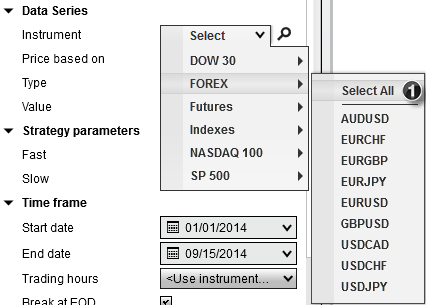
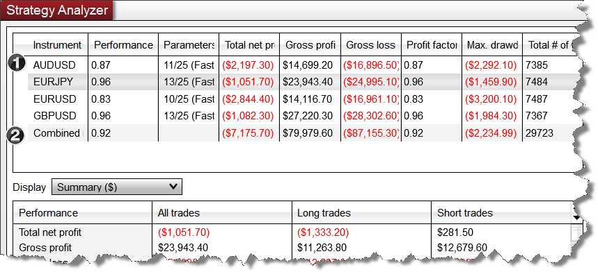


Operations > Strategy Analyzer > Basket testing multiple instruments

Basket Testing
| << [Click to Display Table of Contents](basket_test.md) >> **Navigation:**     [Operations](operations-1.md) > [Strategy Analyzer](strategy_analyzer-1.md) > Basket Testing | [Previous page](understanding_historical_fill_-1.md) [Return to chapter overview](strategy_analyzer-1.md) [Next page](backtest_logs-1.md) |
| --- | --- |
You can [Backtest](backtest_a_strategy-1.md), [Optimize](optimize_a_strategy-1.md) or [Walk Forward](walk_forward_optimize_a_strate-1.md) optimize a basket of instruments by selecting an instrument list using the instrument selector in the settings panel. 

 
Once the test is complete, a listing of all the results will be displayed. 
 

 
1.Each instrument's backtest results are displayed individually

 
2.The combined backtest results of ALL instruments are shown at the bottom of the results

 
Selecting an individual row from the results grid will display the results in the Performance tabs individual [performance results](reviewing_performance_results-1.md).
 
## Reviewing Combined Results
When reviewing the following combined results, some values will be the total summation across all instruments, while others will be weighted to the total number number of trades.
 
The following results will be a summation across all instruments:
 
- Total net profit

- Gross profit

- Gross loss

- Commission

- Total # of trades

- # of winning trades

- # of losing trades

- # of even trades

 
For all other statistics, the combined results will be a weighted average (exception here is the RSquared statistic).
 
## Calculating Weighted Combined Results
In order to understand how weighted combined results are calculated, lets use a simplified example which focuses on the Max. Drawdown across 4 different instruments:
 
| Instrument | Max. Drawdown | Total # of trades |
| --- | --- | --- |
| AUDUSD | ($250.00) | 200 |
| EURJPY | ($150.00) | 105 |
| EURUSD | ($200.00) | 20 |
| GBPUSD | ($50.00) | 90 |
| Combined Results | (178.92) | 415 |

 
As you can see, the Max.Drawdown column is NOT equal to the sum of the individual Max.Drawdown values for the that column.  This is because the total # of trades for the individual instrument and the total # of trades taken across all instruments is used to help provide more accurate statistics.  Working from the table above, the formula used to calculate these weighted averages can be expressed as follows:
 
Combined Max.Drawdown = SUM((AUDUSD Drawdown * AUDUSD Trade Count) + (EURJPY Drawdown * EURJPY Trade Count) + (EURUSD Drawdown * EURUSD Trade Count) + (GBPUSD Drawdown * GBPUSD Trade Count)) / Total Trade Count of All Instruments 

