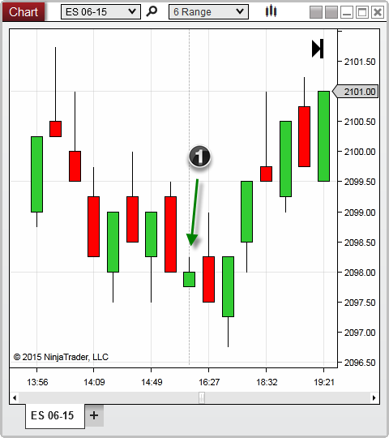
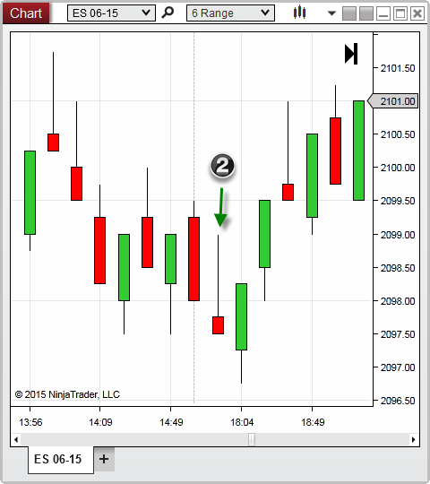


Operations \> Charts \> Break at EOD
Break at EOD
| \<\< [Click to Display Table of Contents](break_at_eod.md) \>\> **Navigation:**     [Operations](operations.md) \> [Charts](charts.md) \> Break at EOD | [Previous page](how_trade_executions_are_plott.md) [Return to chapter overview](charts.md) [Next page](order_flow_plus.md) |
| --- | --- |
## Break at EOD (End Of Day)
You can optionally set NinjaTrader to break its bars on each new end of day session, or continue building until completed.  This property can impact the way price is analyzed during the end of a trading session, and can therefore affect the way an indicator or strategy is calculated.
 
With Break at EOD enabled, your bars are ensured to have a known starting point of which to give you a consistent, repeatable chart.  This is especially important for bar types that are not based on time such as Volume and Tick based charts.  However, for other bar types such as Range, Point and Figure, or others which are built around price action, enabling this property may cause bars to complete before their criteria has been satisfied.  If you prefer the bar to satisfy to completion before creating a new bar, regardless of the time of day, you will want to ensure you have disabled the Break EOD property.
 
## Break EOD vs Non\-Break EOD
Below you will find a two examples which will compare how Range type bars will be handled at the end of a trading session depending on the Chart's Break EOD property.
 

 
1\. Break EOD enabled \- a new bar was formed during the new trading session before the 6 range bar had completed
 

 
2\. Break EOD disabled \- a new bar was not formed until the criteria for the 6 point range was satisfied

