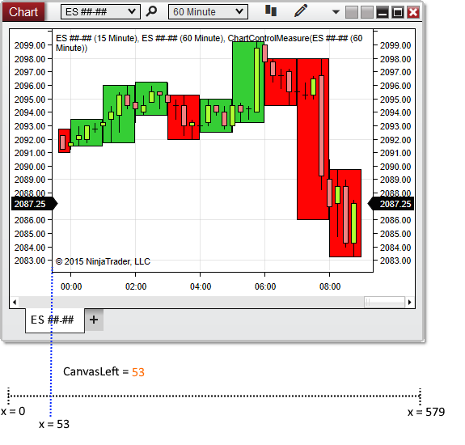


NinjaScript > Language Reference > Common > Charts > ChartControl > CanvasLeft
CanvasLeft
| << [Click to Display Table of Contents](canvasleft.md) >> **Navigation:**     [NinjaScript](ninjascript.md) > [Language Reference](language_reference_wip.md) > [Common](common.md) > [Charts](chart.md) > [ChartControl](chartcontrol.md) > CanvasLeft | [Previous page](barwidtharray.md) [Return to chapter overview](chartcontrol.md) [Next page](canvasright.md) |
| --- | --- |
## Definition
Indicates the x-coordinate (in pixels) of the beginning of the chart canvas area.
## 
## Property Value
A double representing the beginning of the chart canvas area.
## 
## Syntax
<ChartControl>.CanvasLeft
 
## Examples
| ns |
| --- |
| protected override void OnRender(ChartControl chartControl, ChartScale chartScale) {    // Store the beginning and ending x-coordinates of the canvas area    double canvasBeginCoordinate = chartControl.CanvasLeft;    double canvasEndCoordinate = chartControl.CanvasRight;      // Print the stored values    Print(String.Format("Chart canvas begins at x-coordinate {0} and ends at x-coordinate {1}", canvasBeginCoordinate, canvasEndCoordinate));  } |

Based on the image below, CanvasLeft reveals that the chart canvas area begins at x-coordinate 53.
 

| Note: When no data series are left-aligned on a chart, CanvasLeft will return 0, representing the x-coordinate origin, because the chart canvas will begin at coordinate 0. |
| --- |

