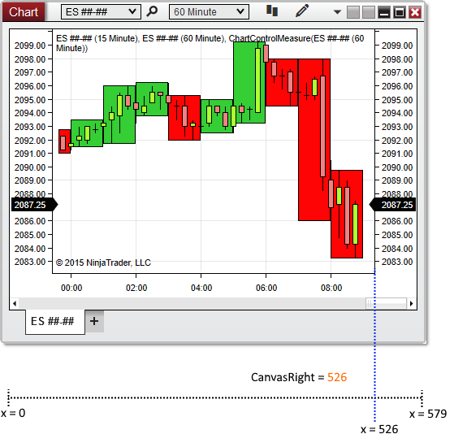



CanvasRight

|  |  |
| --- | --- |
| << [Click to Display Table of Contents](canvasright.htm) >>  **Navigation:**  [NinjaScript](ninjascript.htm) > [Language Reference](language_reference_wip.htm) > [Common](common.htm) > [Charts](chart.htm) > [ChartControl](chartcontrol.htm) >  CanvasRight | [Previous page](canvasleft.htm) [Return to chapter overview](chartcontrol.htm) [Next page](canvaszoomstate.htm) |

Definition
----------

Indicates the x-coordinate (in pixels) of the end of the chart canvas area.

Property Value
--------------

A double representing the end of the chart canvas area.

Syntax
------

<ChartControl>.CanvasRight

Examples
--------

| ns |
| --- |
| protected override void OnRender(ChartControl chartControl, ChartScale chartScale)  {     // Store the beginning and ending x-coordinates of the canvas area     double canvasBeginCoordinate = chartControl.CanvasLeft;     double canvasEndCoordinate = chartControl.CanvasRight;        // Print the stored values     Print(String.Format("Chart canvas begins at x-coordinate {0} and ends at x-coordinate {1}", canvasBeginCoordinate, canvasEndCoordinate));   } |

 

 

Based on the image below, CanvasRight reveals that the chart canvas ends at x-coordinate 526.

 

