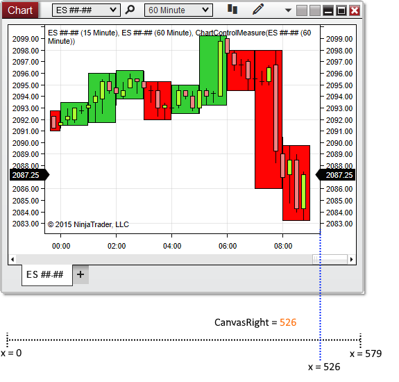

NinjaScript > Language Reference > Common > Charts > ChartControl > CanvasRight
CanvasRight
| << [Click to Display Table of Contents](canvasright.md) >> **Navigation:**     [NinjaScript](ninjascript.md) > [Language Reference](language_reference_wip.md) > [Common](common.md) > [Charts](chart.md) > [ChartControl](chartcontrol.md) > CanvasRight | [Previous page](canvasleft.md) [Return to chapter overview](chartcontrol.md) [Next page](canvaszoomstate.md) |
| --- | --- |
## Definition
Indicates the x-coordinate (in pixels) of the end of the chart canvas area.
## 
## Property Value
A double representing the end of the chart canvas area.
## 
## Syntax
<ChartControl>.CanvasRight
## 
## Examples
| ns |
| --- |
| protected override void OnRender(ChartControl chartControl, ChartScale chartScale) {    // Store the beginning and ending x-coordinates of the canvas area    double canvasBeginCoordinate = chartControl.CanvasLeft;    double canvasEndCoordinate = chartControl.CanvasRight;      // Print the stored values    Print(String.Format("Chart canvas begins at x-coordinate {0} and ends at x-coordinate {1}", canvasBeginCoordinate, canvasEndCoordinate));  } |

Based on the image below, CanvasRight reveals that the chart canvas ends at x-coordinate 526.
 

