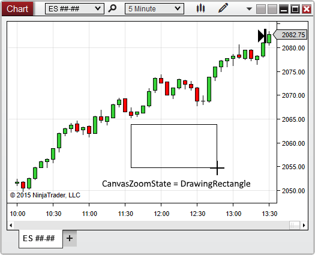

NinjaScript \> Language Reference \> Common \> Charts \> ChartControl \> CanvasZoomState

CanvasZoomState

| \<\< [Click to Display Table of Contents](canvaszoomstate.md) \>\> **Navigation:**     [NinjaScript](ninjascript-1.md) \> [Language Reference](language_reference_wip-1.md) \> [Common](common-1.md) \> [Charts](chart-1.md) \> [ChartControl](chartcontrol-1.md) \> CanvasZoomState | [Previous page](canvasright-1.md) [Return to chapter overview](chartcontrol-1.md) [Next page](chartpanels-1.md) |
| --- | --- |

## Definition

Indicates the current state of the Zoom tool on the chart. This property reveals the state of the tool while it is in use, and does not indicate a chart is zoomed in on or not. As soon as a zoom action is completed, the tool is considered to be no longer in use.

## 

## Property Value

An enum representing the state of the Zoom tool on the chart. Possible values are listed below:

 

| None | The Zoom tool is not currently being used |
| --- | --- |
| Selected | The Zoom tool is selected, but has not yet been used to zoom in |
| DrawingRectangle | The Zoom tool is currently in use (User is currently drawing the rectangle in which to zoom) |

## 

## Syntax

\<ChartControl\>.CanvasZoomState

## 

## Examples

| ns |
| --- |
| protected override void OnRender(ChartControl chartControl, ChartScale chartScale) {    CanvasZoomState zoomState \= chartControl.CanvasZoomState;      // Trigger an alert while a user is zooming in on a chart    if (zoomState \=\= CanvasZoomState.DrawingRectangle)        Alert("zoomAlert", Priority.Medium, "Make sure to zoom in on the entire chart pattern!", " ", 60, Brushes.White, Brushes.Black); } |

 

 

Based on the image below, CanvasZoomState confirms that the Zoom rectangle is currently being drawn:

 

