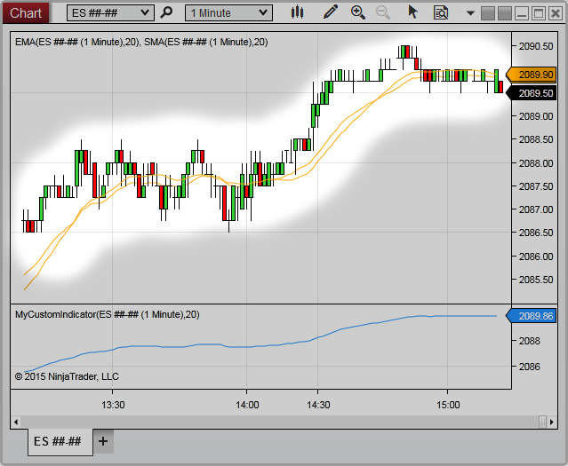


NinjaScript \> Language Reference \> Common \> Charts \> ChartBars
ChartBars
| \<\< [Click to Display Table of Contents](chartbars.md) \>\> **Navigation:**     [NinjaScript](ninjascript.md) \> [Language Reference](language_reference_wip.md) \> [Common](common.md) \> [Charts](chart.md) \> ChartBars | [Previous page](chart.md) [Return to chapter overview](chart.md) [Next page](chartbars_bars.md) |
| --- | --- |
The ChartBars class provides GUI access related methods and properties to the primary bars series configured on the Chart through the [Data Series](working_with_price_data.md) menu.   For data access information related to the NinjaScript input's bars series, please use the [Bars Series](bars.md) object (or the [BarsArray](barsarray.md) for multi\-series input)
 
| Note:  A ChartBars object will ONLY exist should the hosting NinjaScript type be loaded through a [Chart](chart.md).  For example, a Strategy would have access to a ChartBars property when running on a Chart, but would NOT when loaded through the [Strategies Grid](strategies_tab2.md) or [Strategy analyzer](strategy_analyzer.md). |
| --- |

| Warning:  It is crucial to check for object references before accessing the ChartBars otherwise possible null reference errors can be expected depending on where the NinjaScript object was started.  See example below |
| --- |

 
## Methods and Properties
| [Bars](chartbars_bars.md) | Data returned from the historical data repository. |
| --- | --- |
| [Count](chartbars_count.md) | The total number of ChartBars that exist on the chart |
| [FromIndex](chartbars_fromindex.md) | An index value representing the first bar painted on the chart. |
| [GetBarIdxByTime()](chartbars_getbaridxbytime.md) | An ChartBar index value calculated from a time value on the chart. |
| [GetBarIdxByX()](chartbars_getbaridxbyx.md) | Returns the ChartBar index value at a specified x\-coordinate relative to the ChartControl. |
| [GetTimeByBarIdx()](chartbars_gettimebybaridx.md) | The ChartBars time value calculated from a bar index value on the chart. |
| [Panel](chartbars_panel.md) | The Panel index value that the ChartBars eside. |
| [Properties](chartbars_properties.md) | Various ChartBar properties that have been configured from the Chart's [Data Series](working_with_price_data.md) menu. |
| [ToChartString()](chartbars_tochartstring().md) | A string formatted for the Chart's Data Series Label as well as the period. |
| [ToIndex](chartbars_toindex.md) | An index value representing the last bar painted on the chart. |

Example
| ns |
| --- |
| protected override void OnStateChange() {             if (State \=\= State.DataLoaded)    {      if(ChartBars !\= null)      {          Print("The starting number of bars on the chart is " \+ ChartBars.Bars.Count);      }      else       {          Print("Strategy was not loaded from a chart, exiting strategy...");          return;      }    } } |

