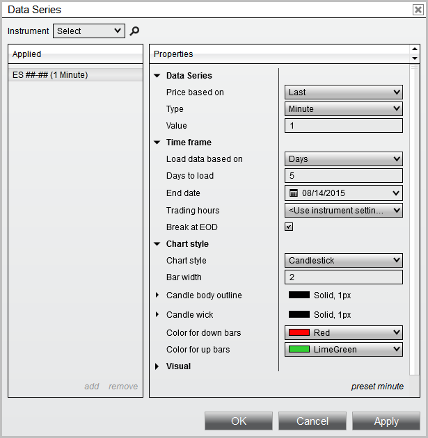



NinjaScript \> Language Reference \> Common \> Charts \> ChartBars \> Properties

Properties

| \<\< [Click to Display Table of Contents](chartbars_properties.md) \>\> **Navigation:**     [NinjaScript](ninjascript.md) \> [Language Reference](language_reference_wip.md) \> [Common](common.md) \> [Charts](chart.md) \> [ChartBars](chartbars.md) \> Properties | [Previous page](chartbars_panel.md) [Return to chapter overview](chartbars.md) [Next page](chartbars_tochartstring().md) |
| --- | --- |

## Definition

Represents various [ChartBar](chartbars.md) properties configured from the Chart's [Data Series](working_with_price_data.md) menu.  

 

| Note:  The properties on this page indicate what have been configured by the user, and is NOT necessarily representative of what is actually contained on the chart.  For example, a user may have a requested 120 days of chart data, however only 60 days of bar data actually returned from their provider. |
| --- |

 

 

 

 

| Warning:  These are UI properties which are designed to be set by a user.  Attempting to modify these values through a custom script is NOT guaranteed to take effect. |
| --- |

 

 

## Properties

| AutoScale | A bool indicating if the Chart Data Series participates in the chart's auto scaling methods |
| --- | --- |
| BarsBack | An int representing the Chart's Data Series configured "Bars to load" when the RangeType.Bars is selected |
| BarsPeriod | The [BarsPeriod](barsperiod.md) object configured for Chart's Data Series |
| CenterPriceOnScale | A bool indicating if the Chart's Data Series should center the last traded price on the chart scale |
| ChartStyle | The [ChartStyle](chart_style.md) object configured for the Chart's Data Series |
| ChartStyleType | A ChartStyleType enum indicating the type of chart style configured.  System defaults include:   •ChartStyleType.Box,•ChartStyleType.CandleStick,•ChartStyleType.LineOnClose,•ChartStyleType.OHLC,•ChartStyleType.PointAndFigure, •ChartStyleType.KagiLine, •ChartStyleType.OpenClose,•ChartStyleType.Mountain |
| DaysBack | An int representing the Chart's Data Series configured "Days to load" when the RangeType.Days is selected |
| DisplayInDataBox | A bool indicating if the Chart's Data Series value should display in the Chart's [Data Box](data_box.md) |
| DisplayName | A string representing the Chart's Data Series instrument and period |
| From | A DateTime representing the Chart's Data Series configured "Start Date" when the RangeType.CustomRange configured. |
| Instrument | A string representing the Chart's Data Series instrument |
| IsStableSession | A bool indicating the Chart's Data Series [Break EOD](break_at_eod.md) option is configured |
| IsTickReplay | A bool indicating the Chart's Data Series [Tick Replay](tick_replay.md) option is configured |
| Label | A string representing the configured Chart's Data Series "Label" |
| LongExecutionBrush | A [Brush](brushes.md) object representing the Chart's Data Series "Color for execution \- buy" brush configured |
| PaintPriceMarker | A bool indicating the Chart's Data Series Price Marker "Visible" option is configured |
| Panel | An int indicating whichChart's Data Series "Panel" the [ChartBars](chartbars.md) are configured |
| PlotExecutions | A ChartExecutionStyle enum representing "Plot executions" option.  Possible values include:   •ChartExecutionStyle.DoNotPlot,•ChartExecutionStyle.MarkersOnly,•ChartExecutionStyle.TextAndMarker |
| PositionPenLoser | A [Stroke](stroke_class.md) object representing the Chart's Data Series "NinjaScript strategy unprofitable trade line" |
| PositionPenWinner | A [Stroke](stroke_class.md) object representing the Chart's Data Series "NinjaScript strategy profitable trade line" |
| PriceMarker | A PriceMarker object representing various brushes used to paint the Chart's Data Series "Price marker" |
| RangeType | A RangeType enum indicating the "Load data based on" value configured on the Data Series.  Possible values include:    •RangeType.Bars,•RangeType.Days,•RangeType.CustomRange |
| ScaleJustification | A ScaleJustification enum indicating the "Scale justification" option configured on the Chart's Data Series.  Possible values include:   •ScaleJustification.Right,•ScaleJustification.Left,•ScaleJustification.Overlay |
| ShortExecutionBrush | A [Brush](brushes.md) object representing the Chart's Data Series "Color for execution \- sell" brush configured |
| ShowGlobalDrawObjects | A bool indicating the Chart's Data Series "Show global draw object" option is configured |
| To | A DateTime representing the configured "End Date" used with any RangeType |
| TradingHoursBreakLine | A TradingHoursBreakLine object representing the [stroke](stroke_class.md) used and TradingHoursBreakLineVisible enum used for the Chart's Data Series "Trading hours break line". Possible TradingHoursBreakLine.TradingHoursBreakLineVisible values include:   •TradingHoursBreakLineVisible.AllSessions, •TradingHoursBreakLineVisible.EodOnly,•TradingHoursBreakLineVisible.Off |
| TradingHoursData | A string representing the Chart's Data Series configured "Trading hours" option |

