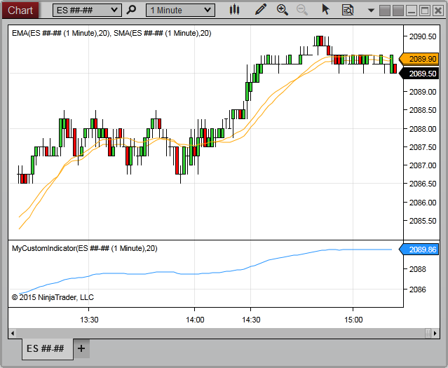


NinjaScript \> Language Reference \> Common \> Charts \> ChartControl

ChartControl
| \<\< [Click to Display Table of Contents](chartcontrol.md) \>\> **Navigation:**     [NinjaScript](ninjascript-1.md) \> [Language Reference](language_reference_wip-1.md) \> [Common](common-1.md) \> [Charts](chart-1.md) \> ChartControl | [Previous page](chartbars_toindex-1.md) [Return to chapter overview](chart-1.md) [Next page](axisxheight-1.md) |
| --- | --- |
The ChartControl class provides access to a wide range of properties and methods related to the location of objects on a chart and other chart\-related properties.  The ChartControl object provides information related to the entire hosting grid of the chart, which overlap with the [ChartPanel](chartpanel-1.md), [ChartScale](chartscale-1.md) and [ChartBars](chartbars-1.md).

| Note: The ChartControl object is ONLY guaranteed to be available when a NinjaScript type initiates from a Chart Window.  There are situations where an indicator or strategy starts from another Windows (such as the Control Center's Strategies Grid, or from a Strategy Analyzer), where the ChartContol object is NOT accessible.   Therefore, the ChartControl object should always be safely accessed (e.g., from within a try\-catch, or conditionally using null reference checks) |
| --- |

 
## 
| Warning:  The ChartControl and its methods and properties should ONLY be access once the [State](state-1.md) has reached State.Historical |
| --- |

## Methods and Properties
| [AxisXHeight](axisxheight-1.md) | Measures the distance (in pixels) between the x\-axis and the top of the horizontal scroll bar |
| --- | --- |
| [AxisYLeftWidth](axisyleftwidth-1.md) | Measures the distance (in pixels) between the y\-axis and the left margin of a chart |
| [AxisYRightWidth](axisyrightwidth-1.md) | Measures the distance (in pixels) between the y\-axis and the right margin of a chart |
| [BarMarginLeft](barmarginleft-1.md) | Measures the margin to the left of each bar on the chart, in pixels |
| [BarsArray](chartcontrol_barsarray-1.md) | Provides a collection of [ChartBars](chartbars-1.md) objects currently configured on the chart |
| [BarSpacingType](barspacingtype-1.md) | Provides the type of bar spacing used for the primary [Bars](bars-1.md) object on the chart |
| [BarsPeriod](chartcontrol_barsperiod-1.md) | Provides the period (interval) used for the primary [Bars](bars-1.md) object on the chart |
| [BarWidth](chartcontrol_barwidth-1.md) | Measures the value of the bar width set for the primary Bars object on the chart |
| [BarWidthArray](barwidtharray-1.md) | An array containing the values of the [BarWidth](chartcontrol_barwidth-1.md) properties of all Bars objects on the chart |
| [CanvasLeft](canvasleft-1.md) | Indicates the x\-coordinate (in pixels) of the beginning of the chart canvas area |
| [CanvasRight](canvasright-1.md) | Indicates the x\-coordinate (in pixels) of the end of the chart canvas area |
| [CanvasZoomState](canvaszoomstate-1.md) | Indicates the current state of the Zoom tool on the chart |
| [ChartPanels](chartpanels-1.md) | Holds a collection of [ChartPanel](chartpanel-1.md) objects |
| [CrosshairType](crosshairtype-1.md) | Indicates the [Cross Hair](cross_hair-1.md) type currently enabled on the chart |
| [FirstTimePainted](firsttimepainted-1.md) | Indicates a time value of the first bar painted on the chart |
| [GetBarPaintWidth()](getbarpaintwidth-1.md) | Returns the width of the bars in the primary Bars object on the chart, in pixels |
| [GetSlotIndexByTime()](getslotindexbytime-1.md) | Returns the slot index of the primary [Bars](bars-1.md) object on the chart corresponding to a specified time value |
| [GetSlotIndexByX()](getslotindexbyx-1.md) | Returns the slot index of the primary [Bars](bars-1.md) object on the chart corresponding to a specified x\-coordinate on the visible chart canvas |
| [GetTimeBySlotIndex()](gettimebyslotindex-1.md) | Returns a time value corresponding to a specified slot index of the primary [Bars](bars-1.md) object on the chart |
| [GetTimeByX()](gettimebyx-1.md) | Returns a time value related to the primary [Bars](bars-1.md)' slot index at a specified x\-coordinate on the chart canvas |
| [GetXByBarIndex()](getxbybarindex-1.md) | Returns the chart\-canvas x\-coordinate of the bar at a specified index of a specified [ChartBars](chartbars-1.md) object on the chart |
| [GetXByTime()](getxbytime-1.md) | Returns the chart\-canvas x\-coordinate of the slot index of the primary [Bars](bars-1.md) object corresponding to a specified time |
| [Indicators](chartcontrol_indicators-1.md) | Returns a collection of indicators currently configured on the chart |
| [IsScrollArrowVisible](isscrollarrowvisible-1.md) | Indicates the time\-axis scroll arrow is visible in the top\-right corner of the chart |
| [IsStayInDrawMode](isstayindrawmode-1.md) | Indicates the [Stay in Draw Mode](working_with_drawing_tools__ob-1.md) is currently enabled on the chart |
| [IsYAxisDisplayedLeft](isyaxisdisplayedleft-1.md) | Indicates the y\-axis displays (in any chart panel) to the left side of the chart canvas |
| [IsYAxisDisplayedOverlay](isyaxisdisplayedoverlay-1.md) | Indicates an object on the chart is using the Overlay scale justification |
| [IsYAxisDisplayedRight](isyaxisdisplayedright-1.md) | Indicates the y\-axis displays (in any chart panel) to the right side of the chart canvas |
| [LastSlotPainted](lastslotpainted-1.md) | Indicates the slot index of the most recently painted bar on the primary [Bars](bars-1.md) object configured on the chart |
| [LastTimePainted](lasttimepainted-1.md) | Indicates the time of the most recently painted bar on the primary [Bars](bars-1.md) object configured on the chart |
| [MouseDownPoint](mousedownpoint-1.md) | Indicates the x\- and y\-coordinates of the mouse cursor at the most recent OnMouseDown() event |
| [Properties](chartcontrol_properties-1.md) | A collection of properties related to the configuration of the Chart |
| [SlotsPainted](slotspainted-1.md) | Indicates the number of index slots in which bars are painted within the chart canvas area |
| [Strategies](chartcontrol_strategies-1.md) | A collection of strategies configured on the chart |
| [TimePainted](timepainted-1.md) | Indicates the range of time in which bars are painted on the visible chart canvas |
