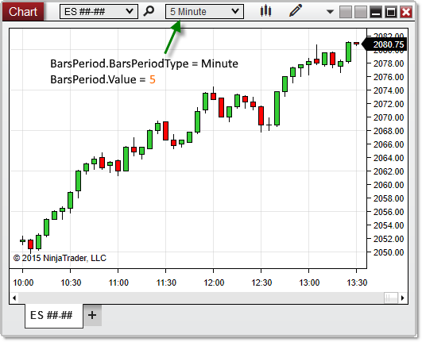



BarsPeriod

|  |  |
| --- | --- |
| << [Click to Display Table of Contents](.\chartcontrol_barsperiod.htm) >>  **Navigation:**  [NinjaScript](ninjascript-1.htm) > [Language Reference](language_reference_wip-1.htm) > [Common](common-1.htm) > [Charts](chart-1.htm) > [ChartControl](chartcontrol-1.htm) >  BarsPeriod | [Previous page](barspacingtype-1.htm) [Return to chapter overview](chartcontrol-1.htm) [Next page](chartcontrol_barwidth-1.htm) |

Definition
----------

Provides the period (interval) used for the primary [Bars](bars-1.htm) object on the chart.

Property Value
--------------

A NinjaTrader.Data.BarsPeriod object containing information on the period used by the Bars object on the chart.

Syntax
------

<ChartControl>.BarsPeriod

Examples
--------

| ns |
| --- |
| protected override void OnRender(ChartControl chartControl, ChartScale chartScale)  {     BarsPeriod period = chartControl.BarsPeriod;        // Print the period (interval) of the Bars object on the chart     Print(period);  } |

 

 

Based on the image below, BarsPeriod confirms that the primary Bars object on the chart is configured to a 5-minute interval.

 

