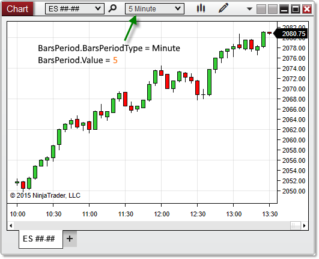

NinjaScript > Language Reference > Common > Charts > ChartControl > BarsPeriod

BarsPeriod
| << [Click to Display Table of Contents](chartcontrol_barsperiod.md) >> **Navigation:**     [NinjaScript](ninjascript.md) > [Language Reference](language_reference_wip.md) > [Common](common.md) > [Charts](chart.md) > [ChartControl](chartcontrol.md) > BarsPeriod | [Previous page](barspacingtype.md) [Return to chapter overview](chartcontrol.md) [Next page](chartcontrol_barwidth.md) |
| --- | --- |
## Definition
Provides the period (interval) used for the primary [Bars](bars.md) object on the chart.
## 
## Property Value
A NinjaTrader.Data.BarsPeriod object containing information on the period used by the Bars object on the chart.
## 
## Syntax
<ChartControl>.BarsPeriod
## 
## Examples
| ns |
| --- |
| protected override void OnRender(ChartControl chartControl, ChartScale chartScale) {    BarsPeriod period = chartControl.BarsPeriod;      // Print the period (interval) of the Bars object on the chart    Print(period); } |

Based on the image below, BarsPeriod confirms that the primary Bars object on the chart is configured to a 5-minute interval.
 

