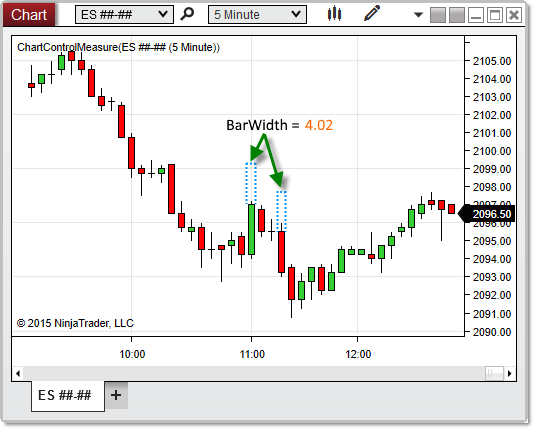


NinjaScript > Language Reference > Common > Charts > ChartControl > BarWidth
BarWidth
| << [Click to Display Table of Contents](chartcontrol_barwidth.md) >> **Navigation:**     [NinjaScript](ninjascript-1.md) > [Language Reference](language_reference_wip-1.md) > [Common](common-1.md) > [Charts](chart-1.md) > [ChartControl](chartcontrol-1.md) > BarWidth | [Previous page](chartcontrol_barsperiod-1.md) [Return to chapter overview](chartcontrol-1.md) [Next page](barwidtharray-1.md) |
| --- | --- |
## Definition
Measures the value of the [bar width](barwidth-1.md) set for the primary Bars object on the chart. 
 
| Note: This property value is not stated in pixels. To obtain the pixel-width of bars on the chart, use [GetBarPaintWidth(](chartcontrol_getbarpaintwidth-1.md)) instead. |
| --- |

## Property Value
A double representing the value of the bar width.
## 
## Syntax
<ChartControl>.BarWidth
## 
## Examples
| ns |
| --- |
| protected override void OnRender(ChartControl chartControl, ChartScale chartScale) {    double barWidth = chartControl.BarWidth;      // Prints the width of bars on the chart    Print(barWidth); } |

Based on the image below, BarWidth reveals that the bars on the chart are 4.02 pixels wide.
 

