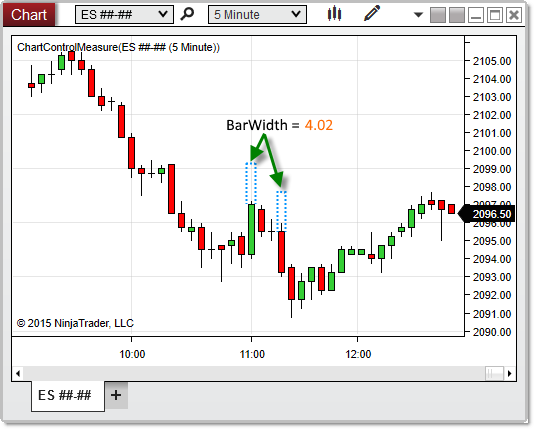

NinjaScript \> Language Reference \> Common \> Charts \> ChartControl \> BarWidth
BarWidth
| \<\< [Click to Display Table of Contents](chartcontrol_barwidth.md) \>\> **Navigation:**     [NinjaScript](ninjascript.md) \> [Language Reference](language_reference_wip.md) \> [Common](common.md) \> [Charts](chart.md) \> [ChartControl](chartcontrol.md) \> BarWidth | [Previous page](chartcontrol_barsperiod.md) [Return to chapter overview](chartcontrol.md) [Next page](barwidtharray.md) |
| --- | --- |
## Definition
Measures the value of the [bar width](barwidth.md) set for the primary Bars object on the chart. 
 
| Note: This property value is not stated in pixels. To obtain the pixel\-width of bars on the chart, use [GetBarPaintWidth(](chartcontrol_getbarpaintwidth.md)) instead. |
| --- |

## Property Value
A double representing the value of the bar width.
## 
## Syntax
\<ChartControl\>.BarWidth
## 
## Examples
| ns |
| --- |
| protected override void OnRender(ChartControl chartControl, ChartScale chartScale) {    double barWidth \= chartControl.BarWidth;      // Prints the width of bars on the chart    Print(barWidth); } |

Based on the image below, BarWidth reveals that the bars on the chart are 4\.02 pixels wide.
 

