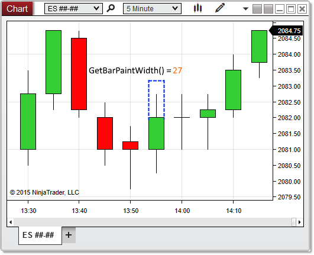



GetBarPaintWidth()

|  |  |
| --- | --- |
| << [Click to Display Table of Contents](.\chartcontrol_getbarpaintwidth.htm) >>  **Navigation:**  [NinjaScript](ninjascript-1.htm) > [Language Reference](language_reference_wip-1.htm) > [Common](common-1.htm) > [Charts](chart-1.htm) > [ChartControl](chartcontrol-1.htm) >  GetBarPaintWidth() | [Previous page](firsttimepainted-1.htm) [Return to chapter overview](chartcontrol-1.htm) [Next page](getslotindexbytime-1.htm) |

Definition
----------

Returns the width of the bars in the primary Bars object on the chart, in pixels.

Method Return Value
-------------------

A double representing the pixel width of bars on the chart

Syntax 
<ChartControl>.GetBarPaintWidth(ChartBars chartBars)
------------------------------------------------------------

Method Parameters
-----------------

|  |  |
| --- | --- |
| chartBars | A [ChartBars](chartbars-1.htm) object to measure |

Example
-------

| ns |
| --- |
| protected override void OnRender(ChartControl chartControl, ChartScale chartScale)  {     // Use BarsArray[0] to pass in a ChartBars object representing the primary Bars object on the chart     double barPixelWidth = chartControl.GetBarPaintWidth(chartControl.BarsArray[0]);        // Print the pixel width of bars painted on the chart     Print(String.Format("Bars on the chart are {0} pixels wide", barPixelWidth));     } |

 

 

In the image below, GetBarPaintWidth() reveals that the bars are being drawn 27 pixels wide on the chart:

 

