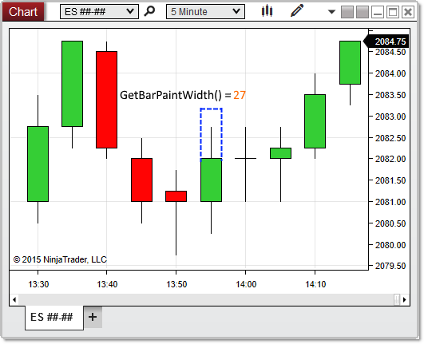


NinjaScript > Language Reference > Common > Charts > ChartControl > GetBarPaintWidth()
GetBarPaintWidth()
| << [Click to Display Table of Contents](chartcontrol_getbarpaintwidth.md) >> **Navigation:**     [NinjaScript](ninjascript-1.md) > [Language Reference](language_reference_wip-1.md) > [Common](common-1.md) > [Charts](chart-1.md) > [ChartControl](chartcontrol-1.md) > GetBarPaintWidth() | [Previous page](firsttimepainted-1.md) [Return to chapter overview](chartcontrol-1.md) [Next page](getslotindexbytime-1.md) |
| --- | --- |
## Definition
Returns the width of the bars in the primary Bars object on the chart, in pixels.
 
## Method Return Value
A double representing the pixel width of bars on the chart
 
## Syntax
<ChartControl>.GetBarPaintWidth(ChartBars chartBars)
 
## 
## Method Parameters
| chartBars | A [ChartBars](chartbars-1.md) object to measure |
| --- | --- |
 
## 
## Example
| ns |
| --- |
| protected override void OnRender(ChartControl chartControl, ChartScale chartScale) {    // Use BarsArray[0] to pass in a ChartBars object representing the primary Bars object on the chart    double barPixelWidth = chartControl.GetBarPaintWidth(chartControl.BarsArray[0]);      // Print the pixel width of bars painted on the chart    Print(String.Format("Bars on the chart are {0} pixels wide", barPixelWidth));    } |

In the image below, GetBarPaintWidth() reveals that the bars are being drawn 27 pixels wide on the chart:
 

