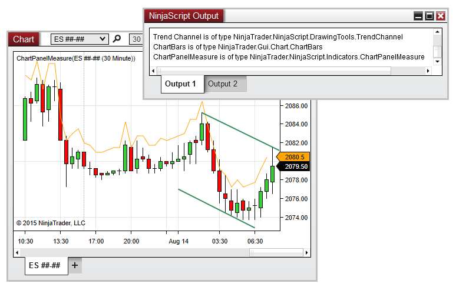

NinjaScript \> Language Reference \> Common \> Charts \> ChartPanel \> ChartObjects

ChartObjects

| \<\< [Click to Display Table of Contents](chartobjects.md) \>\> **Navigation:**     [NinjaScript](ninjascript.md) \> [Language Reference](language_reference_wip.md) \> [Common](common.md) \> [Charts](chart.md) \> [ChartPanel](chartpanel.md) \> ChartObjects | [Previous page](chartpanel.md) [Return to chapter overview](chartpanel.md) [Next page](h_height_chartpanel.md) |
| --- | --- |

## Definition

A collection of objects configured on the chart panel

## 

## Property Value

An [IList](https://msdn.microsoft.com/en-us/library/system.collections.ilist(v=vs.110).aspx) of Gui.NinjaScript.IChartObject instances containing references to the objects configured on the panel

 

## Syntax

ChartPanel.ChartObjects

## 

## Example

| ns |
| --- |
| protected override void OnRender(ChartControl chartControl, ChartScale chartScale) {    base.OnRender(chartControl, chartScale);      IList\<Gui.NinjaScript.IChartObject\> myObjects \= ChartPanel.ChartObjects;      foreach (Gui.NinjaScript.IChartObject thisObject in myObjects)    {        Print(String.Format("{0} is of type {1}", thisObject.Name, thisObject.GetType()));    } } |

 

 

The image below shows the output of the code example above, while applied in a chart panel with three objects.

 

