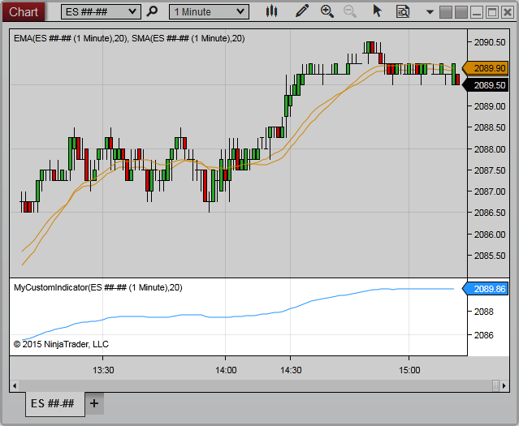

NinjaScript \> Language Reference \> Common \> Charts \> ChartPanel

ChartPanel

| \<\< [Click to Display Table of Contents](chartpanel.md) \>\> **Navigation:**     [NinjaScript](ninjascript-1.md) \> [Language Reference](language_reference_wip-1.md) \> [Common](common-1.md) \> [Charts](chart-1.md) \> ChartPanel | [Previous page](converttoverticalpixels2-1.md) [Return to chapter overview](chart-1.md) [Next page](chartobjects-1.md) |
| --- | --- |

The ChartPanel class includes a range of properties related to the [panel](chart_panels-1.md) on which the calling script resides.  Each Panel has 3 independent [ChartScales](chartscale-1.md): Left, Right, and Overlay.

 

 

 

## Methods and Properties

| ChartObjects | A collection of objects configured on the chart panel |
| --- | --- |
| H | Indicates the height (in pixels) of the chart panel |
| IsFocused | Indicates the chart panel is currently in focus in the window |
| IsWaitingForBars | Indicates one or more objects in the chart panel are waiting for Bars objects to load or refresh |
| IsYAxisDisplayedLeft | Indicates the y\-axis is visible on the left side of the chart panel |
| IsYAxisDisplayedOverlay | Indicates any objects configured in the panel are using the Overlay scale justification |
| IsYAxisDisplayedRight | Indicates the y\-axis is visible on the right side of the chart panel |
| MaxValue | Indicates the maximum Y value of objects within the chart panel |
| MinValue | Indicates the minimum Y value of objects within the chart panel |
| PanelIndex | Indicates the index of the chart panel in the collection of configured panels |
| Scales | A collection of [ChartScale](chartscale-1.md) objects corresponding to objects within the chart panel |
| W | Indicates the width (in pixels) of the chart panel |
| X | Indicates the x\-coordinate on the chart canvas at which the chart panel begins |
| Y | Indicates the y\-coordinate on the chart canvas at which the chart panel begins |

