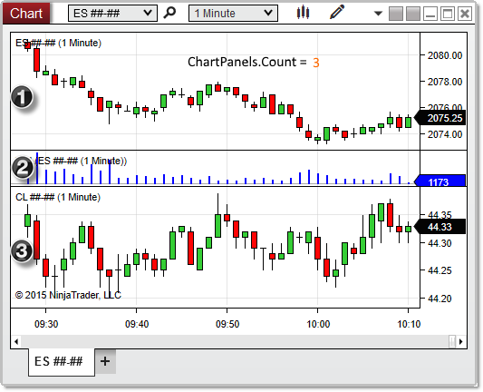

NinjaScript \> Language Reference \> Common \> Charts \> ChartControl \> ChartPanels

ChartPanels
| \<\< [Click to Display Table of Contents](chartpanels.md) \>\> **Navigation:**     [NinjaScript](ninjascript.md) \> [Language Reference](language_reference_wip.md) \> [Common](common.md) \> [Charts](chart.md) \> [ChartControl](chartcontrol.md) \> ChartPanels | [Previous page](canvaszoomstate.md) [Return to chapter overview](chartcontrol.md) [Next page](crosshairtype.md) |
| --- | --- |
## Definition
Holds a collection of [ChartPanel](chartpanel.md) objects containing information about the panels active on the chart.
## 
## Property Value
An [ObservableCollection](https://msdn.microsoft.com/en-us/library/ms668604(v=vs.110).aspx) of ChartPanel objects
## 
## Syntax
\<ChartControl\>.ChartPanels
## 
## Examples
| ns |
| --- |
| protected override void OnRender(ChartControl chartControl, ChartScale chartScale) {    // Print the number of panels currently displayed on the chart    Print(String.Format("There are {0} panels on the chart", chartControl.ChartPanels.Count));   } |

Based on the image below, there are three ChartPanel objects in the ChartPanels collection, as seen by ChartPanels.Count in the code above.
 

