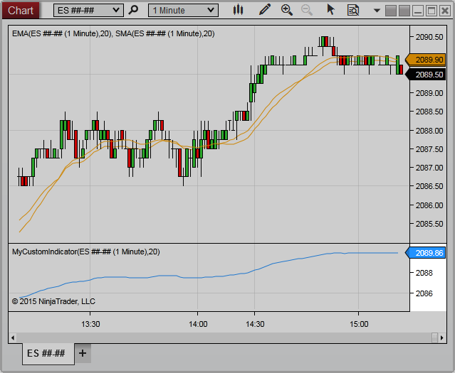



NinjaScript \> Language Reference \> Common \> Charts \> ChartScale

ChartScale

| \<\< [Click to Display Table of Contents](chartscale.md) \>\> **Navigation:**     [NinjaScript](ninjascript-1.md) \> [Language Reference](language_reference_wip-1.md) \> [Common](common-1.md) \> [Charts](chart-1.md) \> ChartScale | [Previous page](y_coordinate_chartpanel-1.md) [Return to chapter overview](chart-1.md) [Next page](getpixelsfordistance-1.md) |
| --- | --- |

The ChartScale class includes a range of properties related to the Y\-Axis values of the [ChartPanel](chartpanel-1.md) on which the calling script resides.  The ChartScale can be configured to Right, Left, or Overlay.

 

 

## Methods and Properties

| [GetPixelsForDistance()](getpixelsfordistance-1.md) | Returns the number of device pixels between the value passed to the method representing a series point value on the chart scale |
| --- | --- |
| [GetValueByY()](getvaluebyy-1.md) | Returns the series value on the chart scale determined by a y pixel coordinate on the chart |
| [GetValueByYWpf()](getvaluebyywpf-1.md) | Returns the series value on the chart scale determined by a WPF coordinate on the chart |
| [GetYByValue()](getybyvalue-1.md) | Returns the chart's y\-pixel coordinate on the chart determined by a series value represented on the chart scale |
| [GetYByValueWpf()](getybyvaluewpf-1.md) | Returns a WPF coordinate on the chart determined by a series value represented on the chart scale |
| [Height](height-1.md) | Indicates the overall distance (from top to bottom) of the chart scale in device pixels |
| [IsVisible](chartscale_isvisible-1.md) | Indicates if the chart scale is viewable on the UI |
| [MaxMinusMin](maxminusmin-1.md) | The difference between the chart scale's [MaxValue](chartscale_maxvalue-1.md) and [MinValue](chartscale_minvalue-1.md) represented as a y value |
| [MaxValue](chartscale_maxvalue-1.md) | The highest displayed value on the chart scale |
| [MinValue](chartscale_minvalue-1.md) | The lowest rendered value on the chart scale |
| [PanelIndex](panelindex-1.md) | The panel on which the chart scale resides |
| [Properties](chartscale_properties-1.md) | Represents a number of properties available to the Chart Scale which can be configured to change the appearance of the scale |
| [ScaleJustification](chartscale_scalejustification-1.md) | Indicates the location of the chart scale relative to the chart control |
| [Width](width-1.md) | Indicates the overall distance (from left to right) of the chart scale in device pixels |

