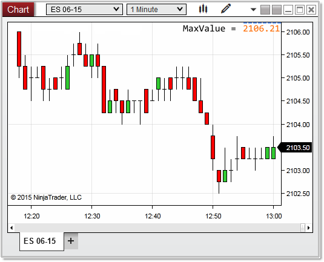


NinjaScript > Language Reference > Common > Charts > ChartScale > MaxValue
MaxValue

| << [Click to Display Table of Contents](chartscale_maxvalue.md) >> **Navigation:**     [NinjaScript](ninjascript-1.md) > [Language Reference](language_reference_wip-1.md) > [Common](common-1.md) > [Charts](chart-1.md) > [ChartScale](chartscale-1.md) > MaxValue | [Previous page](maxminusmin-1.md) [Return to chapter overview](chartscale-1.md) [Next page](chartscale_minvalue-1.md) |
| --- | --- |

## Definition
The highest displayed value on the chart scale. 
## 
## Property Value
A double value representing highest value on the chart scale as a y value.
 
## Syntax
<chartScale>.MaxValue
 
## Example
| ns |
| --- |
| protected override void OnRender(ChartControl chartControl, ChartScale chartScale) {             // the maximum value of the chart scale    double maxValue   = chartScale.MaxValue;      Print("maxValue: " + maxValue); } |

In the image below, the highest value displayed as text on the y-axis reads 2106.00, however as you can see, there are a few pixels on the chart scale above this tick.  The absolute rendered MaxValue on the chart scale is calculated as 2106.21  
 

