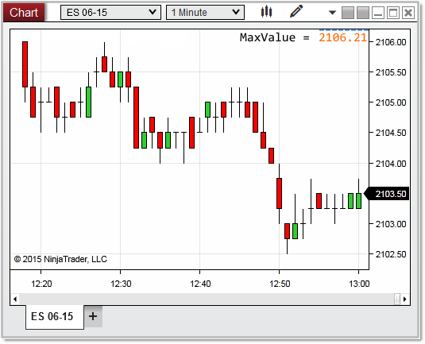



MaxValue

|  |  |
| --- | --- |
| << [Click to Display Table of Contents](.\chartscale_maxvalue.htm) >>  **Navigation:**  [NinjaScript](ninjascript-1.htm) > [Language Reference](language_reference_wip-1.htm) > [Common](common-1.htm) > [Charts](chart-1.htm) > [ChartScale](chartscale-1.htm) >  MaxValue | [Previous page](maxminusmin-1.htm) [Return to chapter overview](chartscale-1.htm) [Next page](chartscale_minvalue-1.htm) |

Definition
----------

The highest displayed value on the chart scale.

Property Value
--------------

A double value representing highest value on the chart scale as a y value.

Syntax
------

<chartScale>.MaxValue

Example
-------

| ns |
| --- |
| protected override void OnRender(ChartControl chartControl, ChartScale chartScale)  {              // the maximum value of the chart scale     double maxValue   = chartScale.MaxValue;        Print("maxValue: " + maxValue);  } |

 

 

In the image below, the highest value displayed as text on the y-axis reads 2106.00, however as you can see, there are a few pixels on the chart scale above this tick.  The absolute rendered MaxValue on the chart scale is calculated as 2106.21

