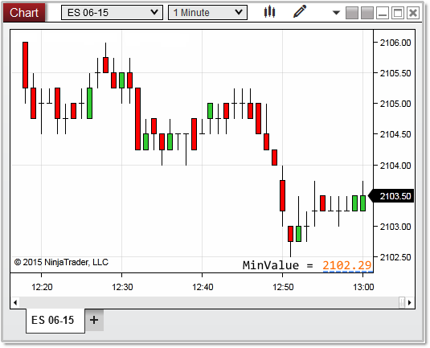


NinjaScript > Language Reference > Common > Charts > ChartScale > MinValue
MinValue

| << [Click to Display Table of Contents](chartscale_minvalue.md) >> **Navigation:**     [NinjaScript](ninjascript-1.md) > [Language Reference](language_reference_wip-1.md) > [Common](common-1.md) > [Charts](chart-1.md) > [ChartScale](chartscale-1.md) > MinValue | [Previous page](chartscale_maxvalue-1.md) [Return to chapter overview](chartscale-1.md) [Next page](panelindex-1.md) |
| --- | --- |

## Definition
The lowest rendered value on the chart scale.
## 
## Property Value
A double value representing lowest value on the chart scale as a y value.
 
Syntax
<chartScale>.MinValue
## 
## Examples
| ns |
| --- |
| protected override void OnRender(ChartControl chartControl, ChartScale chartScale) {             // the minimum value of the chart scale    double minValue   = chartScale.MinValue;      Print("minValue: " + minValue); } |

In the image below, the lowest value displayed as text on the y-axis reads 2102.50, however as you can see, there are a few pixels on the chart scale below this tick.  The absolute rendered MinValue on the chart scale is calculated as 2102.29.  
 

