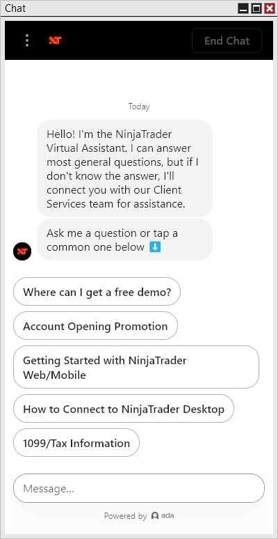


Operations \> Control Center \> Chat

Chat

| \<\< [Click to Display Table of Contents](chat.md) \>\> **Navigation:**     [Operations](operations-1.md) \> [Control Center](control_center-1.md) \> Chat | [Previous page](help_menu-1.md) [Return to chapter overview](control_center-1.md) [Next page](orders_tab-1.md) |
| --- | --- |
The following window is available via the Chat menu of the NinjaTrader Control Center.
 

 
The Chat window connects you to the Virtual Assistant, which can quickly answer many questions. If the Virtual Assistant is unable to resolve your inquiry, you can easily request support from a live representative.
