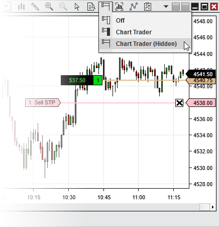


Operations > Order Entry > Chart Trader > Hidden View
Hidden View
| << [Click to Display Table of Contents](collapsed_view.md) >> **Navigation:**     [Operations](operations-1.md) > [Order Entry](order_entry-1.md) > [Chart Trader](chart_trader-1.md) > Hidden View | [Previous page](order__position_display-1.md) [Return to chapter overview](chart_trader-1.md) [Next page](submitting_orders4-1.md) |
| --- | --- |
Chart Trader can be displayed fully, disabled fully, or collapsed. When the collapsed view is enabled, the order and position display functionality of Chart Trader is still enabled, and orders can still be placed and managed directly from the chart panel, but the Chart Trader panel itself will be hidden. This serves to maximize screen space for charts while maintaining much of the important functionality of Chart Trader. 
 
## Collapsing and restoring the Chart Trader panel
There are two ways to collapse the Chart Trader panel. You can either click the Chart Trader icon on the chart toolbar, then select the "Chart Trader (Hidden)" menu item, as seen in the image below, or you can edit the "Chart Trader" property within the [chart Properties](chart_properties-1.md) window. When you wish to view the Chart Trader panel once more, you can use the same methods to select the "Chart Trader" menu item.
 

 
In the image above, we see an open position and a modifiable resting order on the chart, even though the Chart Trader panel is hidden.

