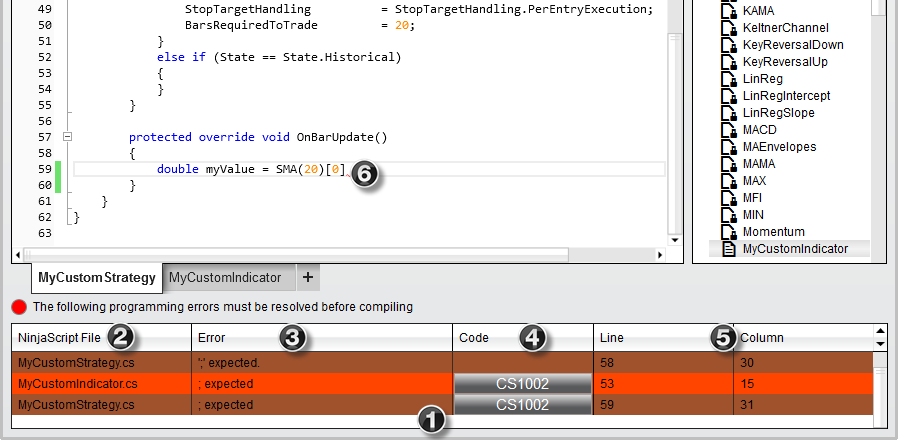



NinjaScript \> Editor \> Compile Errors

Compile Errors

| \<\< [Click to Display Table of Contents](compile_errors.md) \>\> **Navigation:**     [NinjaScript](ninjascript-1.md) \> [Editor](editor-1.md) \> Compile Errors | [Previous page](code_snippets-1.md) [Return to chapter overview](editor-1.md) [Next page](intelliprompt-1.md) |
| --- | --- |

## When compiling a custom indicator or strategy it is possible and likely that you will generate compile errors.

•NinjaTrader will compile ALL NinjaScript files NOT only the file you are working on 

•A list of compile errors for all files will be displayed in the lower portion of the NinjaScript Editor 

•Double click on an error to load the problem file and highlight the problem area 

•Click on the error code to bring up Help Documentation on a specific error 

•Right click on the error to exclude the problem file from compilation (see the section on [Excluding a script from compilation](ns_explorer-1.md) for more information)

 

## The image below illustrates a compile error

1\. Section where compile errors are displayed. Errors in the current loaded file are color coded a light color while errors in other files have a darker color code.

2\. The file that contains the error

3\. A description of the error

4\. A error code link that will open the Help Guide with any relevant error code information

5\. Line number and column number of the error

6\. Error is underlined with a red wavy line

 

The error highlighted by icon (6\) below shows that the expression is not closed with a semicolon. The expression should be:

   

double myValue \= SMA(20\)\[0];

 

