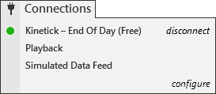



Operations \> Control Center \> Connections Menu

Connections Menu

| \<\< [Click to Display Table of Contents](connections_menu.md) \>\> **Navigation:**     [Operations](operations.md) \> [Control Center](control_center.md) \> Connections Menu | [Previous page](workspaces_menu.md) [Return to chapter overview](control_center.md) [Next page](help_menu.md) |
| --- | --- |

The following menus and items are available via the Tools menu of the NinjaTrader Control Center.

 

 

•You cannot remove the predefined constant connections: Kinetick \- End Of Day (Free), Playback Connection, Simulated Data Feed. 

•You can connect to multiple connections simultaneously. 

•The connection status is reported to the left of the connection name in the connections menu per provider. There is also an aggregated connection status in the bottom left hand corner of the Control Center. For more information please see the "[Connection Status](status_bar.md)" section of the help guide.

•Connections menu will only show connections you are authorized to connect per your license key. If you need to connect to more connections or change the connection technology enabled on your license please contact [\[email protected]](/cdn-cgi/l/email-protection)

| Creating a new connection ControlCenter_ConnectionsConfigure   1\.Click configure to define a new connection.2\.See the connection guide for your provider for detailed steps on how to setup your connection. |
| --- |

        [Connecting to a connection](javascript:HMToggle('toggle','ConnectingToAConnection','ConnectingToAConnection_ICON'))

| Connecting to a connection ControlCenter_Connecting   1\.Click on the connection name to connect to the defined connection. 2\.See the section "Connection Status" below for more information on connection status. |
| --- |

        [Disconnecting from a connection](javascript:HMToggle('toggle','DisconnectingFromAConnection','DisconnectingFromAConnection_ICON'))

| Disconnect a connection ControlCenter_ConnectionDisconnect   1\.When you are connected to a provider in the Connections menu you will see disconnect for each active connection.2\.Select "disconnect" to disconnect from the provider. |
| --- |

        [Understanding the Pre\-Built Connections](javascript:HMToggle('toggle','UnderstandingThePreBuiltConnections','UnderstandingThePreBuiltConnections_ICON'))

| Pre\-Built Connections Although you will need to configure your own connection to a real\-time market data provider and your brokerage account, NinjaTrader comes pre\-loaded with several connections which can be used for different purposes.     | Kinetick \- End of Day (Free) | Provided free of charge by Kinetick, offers daily End\-of\-Day updates for several instrument types, including stocks, forex, and futures | | --- | --- | | Playback Connection | Used to play [Playback](playback_connection.md) data at various speeds (data must be [downloaded](set_up12.md) prior to using the Playback connection) | | Simulated Data Feed | Creates simulated data locally on your PC (not based on real market movements) | |
| --- | --- | --- | --- | --- | --- | --- |

