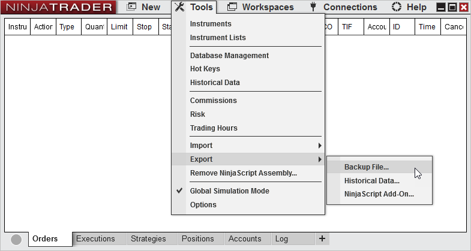
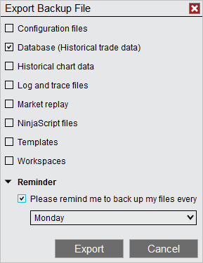
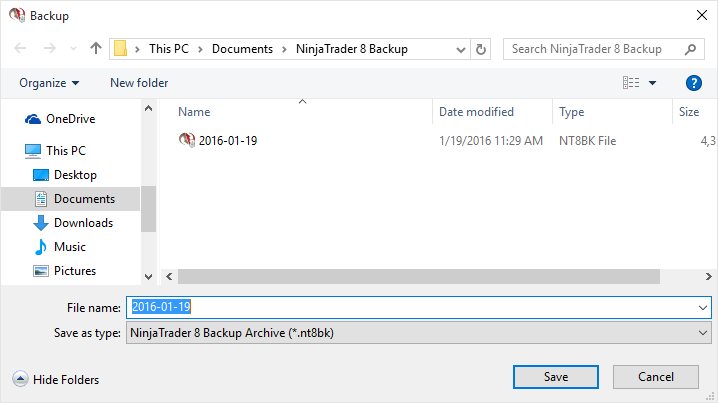
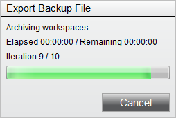


Operations > Backup & Restore > Creating a Backup Archive
Creating a Backup Archive
| << [Click to Display Table of Contents](creating_a_backup_archive.md) >> **Navigation:**     [Operations](operations.md) > [Backup & Restore](backup__restore.md) > Creating a Backup Archive | [Previous page](backup__restore.md) [Return to chapter overview](backup__restore.md) [Next page](restoring_a_backup_archive.md) |
| --- | --- |
## Running your first backup
Complete the following steps to create a Backup Archive.
 
1. Disconnect from all connectivity providers (if connected) and from within the Control Center window select the Tools menu. Then select the menu Export and the menu item Backup File...
 

 
2. The "Backup NinjaTrader" dialog window will appear
3. Select the items you wish to back up (see the table below for definitions)
4. Press the "Export" button
 

 
| Configuration files | Contains user specific information such as license keys, account settings, and other user defined options |
| --- | --- |
| Database (Historical trade data) | Contains your historical trade execution data which is used to build reports in the [Account Performance](trade_performance.md) window |
| Historical chart data* | Chart data which has been recorded from a live connection, [downloaded](download.md) from a data provider, or [manually imported](importing.md) |
| Log and Trace files | Diagnostic files written by the NinjaTrader application to record activity which can be analyzed by our customer service team during support inquiries |
| Market replay* | Data files used to drive the Level 1 and Level 2 price updates when using the Playback connection |
| NinjaScript files | Custom developed indicators, strategy, other add-ons.  This option includes both user developed and 3rd party vendor files |
| Templates | Custom user defined configuration and display settings for features such as Charts, Strategies, Market Analyzer, ATM Strategies, SuperDOM |
| Workspaces | Files which are used to persist the over-all layout of a users working area. |
 
| Tip: Market data files such as Historical chart data can often times be re-downloaded from your data provider.  Market Replay data can be downloaded from the NinjaTrader servers for the most popular Futures and Forex instruments.  If the data files you have stored on your computer are available from your data provider, you can save time and storage space by excluding these items from your backup and simply re-downloaded the data when needed.  Please make sure to check with your data provider to ensure they still carry the type of data for the time period you may require. |
| --- |

5.  Specify the location the backup will be saved and give the file a name to help you identify your backup file.  By default, NinjaTrader will store the backup files in \\Documents\\NinjaTrader 8 Backup folder and will provide your computer's date as the file name.
 

6.  Select the Backup button.
 
You will now be presented with a status bar indicating the estimated time and progress of the backup.  
 

 
| Note: Depending on the amount of information you are backing up, the backup process may go very quickly, and you may not even notice the backup progress window.  You can always verify the backup was completed by navigating to the location you specified for the backup and looking for the file name you provided the backup utility.  Also keep in mind that if your database is very large (i.e., years of historical chart data), it can take some time for the backup to complete. |
| --- |
 
## Scheduling a backup
When running a backup, there is an option labeled "Please remind me to back up my files every..." which if selected, will allow you to specify a day of the week or 1st day of the month to receive a reminder via a pop-up notification to trigger a backup.

