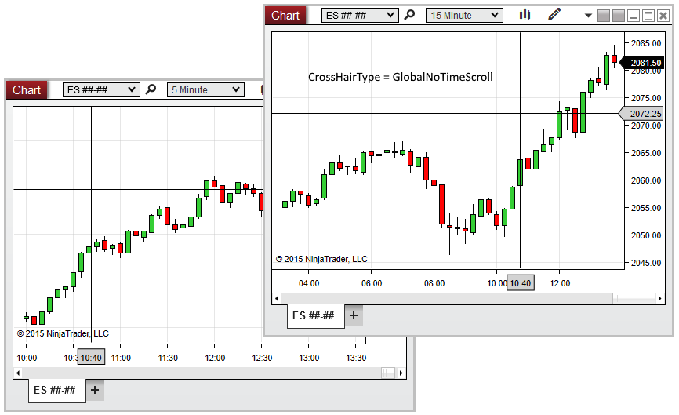

NinjaScript \> Language Reference \> Common \> Charts \> ChartControl \> CrosshairType

CrosshairType

| \<\< [Click to Display Table of Contents](crosshairtype.md) \>\> **Navigation:**     [NinjaScript](ninjascript-1.md) \> [Language Reference](language_reference_wip-1.md) \> [Common](common-1.md) \> [Charts](chart-1.md) \> [ChartControl](chartcontrol-1.md) \> CrosshairType | [Previous page](chartpanels-1.md) [Return to chapter overview](chartcontrol-1.md) [Next page](firsttimepainted-1.md) |
| --- | --- |

## Definition

Indicates the [Cross Hair](cross_hair-1.md) type currently enabled on the chart.

## 

## Property Value

An enum specifying the type of Cross Hair currently enabled on the chart. Possible values are listed below:

 

| Local | The local (single\-chart) Cross Hair is enabled |
| --- | --- |
| Global | Global Cross Hair |
| GlobalNoTimeScroll | Global Cross Hair (No Time Scroll) is enabled |

## 

## Syntax

\<ChartControl\>.CrosshairType

## 

## Examples

| ns |
| --- |
| protected override void OnRender(ChartControl chartControl, ChartScale chartScale) {    // Print a message if the user enables the Global Cross Hair without time scrolling    if (chartControl.CrosshairType \=\= CrosshairType.GlobalNoTimeScroll)        Print("It is recommended to enable Global Cross Hair time scrolling with this indicator"); } |

 

 

In the image below, CrosshairType reveals that Global Cross Hair (No Time Scroll) is enabled on the chart.

 

