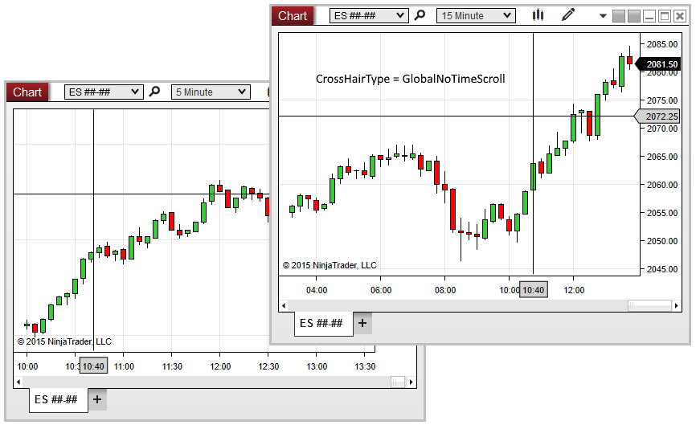



CrosshairType

|  |  |
| --- | --- |
| << [Click to Display Table of Contents](crosshairtype.htm) >>  **Navigation:**  [NinjaScript](ninjascript.htm) > [Language Reference](language_reference_wip.htm) > [Common](common.htm) > [Charts](chart.htm) > [ChartControl](chartcontrol.htm) >  CrosshairType | [Previous page](chartpanels.htm) [Return to chapter overview](chartcontrol.htm) [Next page](firsttimepainted.htm) |

Definition
----------

Indicates the [Cross Hair](cross_hair.htm) type currently enabled on the chart.

Property Value
--------------

An enum specifying the type of Cross Hair currently enabled on the chart. Possible values are listed below:

|  |  |
| --- | --- |
| Local | The local (single-chart) Cross Hair is enabled |
| Global | Global Cross Hair |
| GlobalNoTimeScroll | Global Cross Hair (No Time Scroll) is enabled |

Syntax
------

<ChartControl>.CrosshairType

Examples
--------

| ns |
| --- |
| protected override void OnRender(ChartControl chartControl, ChartScale chartScale)  {     // Print a message if the user enables the Global Cross Hair without time scrolling     if (chartControl.CrosshairType == CrosshairType.GlobalNoTimeScroll)         Print("It is recommended to enable Global Cross Hair time scrolling with this indicator");  } |

 

 

In the image below, CrosshairType reveals that Global Cross Hair (No Time Scroll) is enabled on the chart.

 

