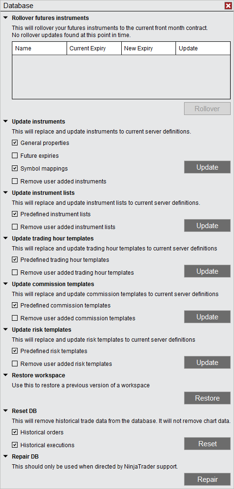



Operations \> Database \> Database Operations

Database Operations

| \<\< [Click to Display Table of Contents](database_operations.md) \>\> **Navigation:**     [Operations](operations-1.md) \> [Database](database-1.md) \> Database Operations | [Previous page](database-1.md) [Return to chapter overview](database-1.md) [Next page](data_grids-1.md) |
| --- | --- |

[Show/Hide Hidden Text](javascript:HMToggleExpandAll(!HMAnyToggleOpen()) "Click to open/close expanding sections")

Various database operations can be performed from the Database window. 

 

 

        [Rollover futures instruments](javascript:HMToggle('toggle','RolloverFuturesInstruments','RolloverFuturesInstruments_ICON'))

| Rollover Futures Instruments This will rollover your futures instrument to the most recent expiries across all open workspaces. If there are instruments open in the workspace that are eligible to be rolled forward they will be shown in the grid. For more information on this process please see the [rolling over a futures contract](rolling_over_a_futures_contrac-1.md) section of the help guide. |
| --- |

        [Update instruments](javascript:HMToggle('toggle','UpdateInstruments','UpdateInstruments_ICON'))

| Update Instruments This will replace and update all instruments to current server definitions.    The NinjaTrader data server maintains definitions for Instruments, NinjaTrader will update your local instrument general properties and symbol mappings should there be any changes on the server automatically. However if you make any changes to the either the general properties or the symbol mappings for an instrument then the instrument would no longer be automatically updated. Using this utility will remove any custom changes you have made locally and update the instrument definition to the servers version.     | General properties | Sets if the General properties of each instrument will be replaced with the server definition | | --- | --- | | Future expiries | Sets if the Contract Months of each Future instrument will be replaced with the server definition | | Symbol mappings | Sets if the Symbol mappings of each instrument will be replaced with the server definition | | Remove user added instruments | Sets if instruments created by the user will also be removed |        | Note: If you would like to report an incorrect or missing server definition please send an email to [\[email protected]](/cdn-cgi/l/email-protection) and we will promptly correct the issue. | | --- | |
| --- | --- | --- | --- | --- | --- | --- | --- | --- | --- |

 

        [Update instrument lists](javascript:HMToggle('toggle','UpdateInstrumentLists','UpdateInstrumentLists_ICON'))

| Update Instruments Lists This will replace and update all instrument lists to current server definitions.    The NinjaTrader data server maintains definitions for the following instrument lists:   •Dow 30•FOREX•Futures•Indexes•NASDAQ 100•SP 500  Any time there is an instrument added or removed to the above instrument lists they will be automatically updated by NinjaTrader. However if you add or remove instruments from the list manually using the Instrument Lists window then the instrument list will no longer continue to be updated automatically by NinjaTrader. Should you wish to update and reset your instrument lists manually then you would use the following update utility.     | Predefined instrument lists | Sets if the General properties of each instrument will be replaced with the server definition | | --- | --- | | Remove user added instrument lists | Sets if instruments created by the user will also be removed |      Note: If you would like to report an incorrect or missing server definition please send an email to [\[email protected]](/cdn-cgi/l/email-protection) and we will promptly correct the issue. |
| --- | --- | --- | --- | --- |

        [Update trading hour templates](javascript:HMToggle('toggle','Updatetradinghourtemplates','Updatetradinghourtemplates_ICON'))

| Update Trading Hour Templates This will replace and update all trading hour templates to current server definitions. |
| --- |

        [Update commissions templates](javascript:HMToggle('toggle','Updatecommissionstemplates','Updatecommissionstemplates_ICON'))

| Update Commissions Templates This will replace and update all commissions templates to current server definitions. |
| --- |

        [Update risk templates](javascript:HMToggle('toggle','Upddatetradinghourtemplates','Upddatetradinghourtemplates_ICON'))

| Update Risk Templates This will replace and update all risk templates to current server definitions. |
| --- |

        [Restore workspace](javascript:HMToggle('toggle','Restoreworkspace','Restoreworkspace_ICON'))

| Restore Workspace This can be used to restore a previous saved version of a saved workspace. When selecting Restore you will be directed to the location of the recovery workspaces. They will be organized in folders with the names of the workspaces. Double click the folder of the workspace you want to recover and then select the recovery file with the date/time that you want to recover.   By default 10 previously saved versions of your workspaces will be retained. To modify how many recovery versions are available within the Control Center go to Tools and select Options. Within the General section go to Preferences and set the Versions of recovery workspaces. See the Options [General](general_section-1.md) section.     | Note: Deleted workspaces cannot be restored using this feature. However, if you have a backup you could restore it from there. See the [Backup \& Restore](backup__restore-1.md) section. | | --- | |
| --- | --- |

        [Reset DB](javascript:HMToggle('toggle','ResetDb','ResetDb_ICON'))

| Reset the Database This will remove historical trade data from the database. It will not remove chart data or reset any [Simulation accounts](simulation-1.md).     | Historical orders | Sets if the historical orders stored in the database will be removed | | --- | --- | | Historical executions | Sets if the historical executions in the database will be removed | |
| --- | --- | --- | --- | --- |

        [Repair DB](javascript:HMToggle('toggle','RepairDb','RepairDb_ICON'))

| Repair the Database This should only be used when directed by NinjaTrader support and performs a repair on the NinjaTrader database. Depending on the size of the database this can take a few moments to complete. |
| --- |

