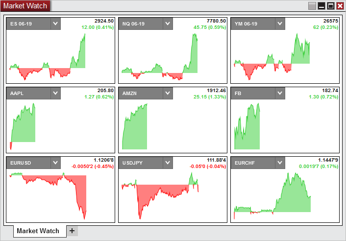
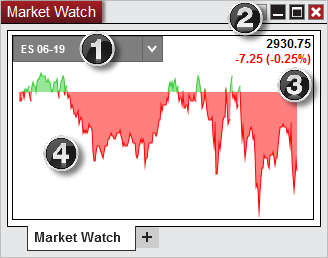



Operations \> Market Watch \> Display Overview

Display Overview

| \<\< [Click to Display Table of Contents](display-overview.md) \>\> **Navigation:**     [Operations](operations-1.md) \> [Market Watch](market-watch-1.md) \> Display Overview | [Previous page](market-watch-1.md) [Return to chapter overview](market-watch-1.md) [Next page](working-with-instrument-tiles-1.md) |
| --- | --- |

To open the Market Watch window, select the New menu from the NinjaTrader Control Center. Then left mouse click on the menu item Market Watch.

 

 

Instruments will need to be added to the Market Watch window to display the instrument tile. One of the ways to do this is by right clicking on the window and going to Add Instrument(s). See the [Working with Instrument Tiles](working-with-instrument-tiles-1.md) section for more information.

## 

## Tile Display

1\.The display for the selected instrument of the tile \& instrument selector

2\.The last price

3\.The net change displayed in points and percent

4\.The net change chart. With default settings the green area are prices that were above the last close and the red area are prices that were below the last close.

 

 

| Notes:  1\. Market Watch requires Last Close to be provided by the data connection. If the data connection does not support Last Close, Market Watch will not properly display (for example FXCM / Forex.com / eSignal are known to not provide Last Close) 2\. Tiles do not have a time relation to one another. For each tile the left of the tile is the open of the session and the right is the end of the session per the default session template for the instrument. |
| --- |

