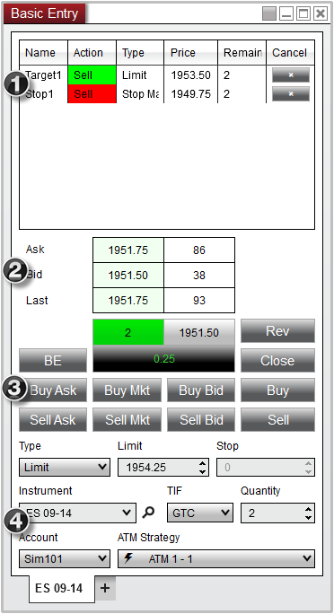


Operations \> Order Entry \> Basic Entry \> Display Overview

Display Overview

| \<\< [Click to Display Table of Contents](display_overview_basic_entry.md) \>\> **Navigation:**     [Operations](operations.md) \> [Order Entry](order_entry.md) \> [Basic Entry](basic_entry.md) \> Display Overview | [Previous page](basic_entry.md) [Return to chapter overview](basic_entry.md) [Next page](submitting_orders_basic_entry.md) |
| --- | --- |
To open the Basic Entry Window, select the New menu from the NinjaTrader Control Center. Then left mouse click on the menu item Basic Entry.
 

| playVideo |
| --- |
|  |
 
The image below shows each of the four sections in the Basic Entry window
 
1\. Order Grid
2\. Position and Level 1 (current inside market) display
3\. Action Buttons
4\. Order entry and ATM Strategy management
 

| Note: Positions and orders will only display for the selected Account and Instrument. |
| --- |
## 

 
Please see the sections below for more information on each on: Order Grid, Market Display, Action Buttons, and Order Control.
        [Understanding the order grid section](javascript:HMToggle('toggle','UnderstandingTheOrderGridSection','UnderstandingTheOrderGridSection_ICON'))

| Order Grid Display The Order Grid displays active orders for the account and instrument selected in the Basic Entry window.   BasicEntry_2   Column Definitions   | Name | Order name such as Stop1 or Target1 | | --- | --- | | Action | Buy or Sell | | Type | Order type | | Price | Order price | | Remaining | Number of contracts/shares remaining to be filled | | Cancel | Cancels the order(s) | |
| --- | --- | --- | --- | --- | --- | --- | --- | --- | --- | --- | --- | --- |
        [Understanding the market display section](javascript:HMToggle('toggle','UnderstandingTheMarketDisplaySection','UnderstandingTheMarketDisplaySection_ICON'))

| Market Data Display The market display section of the Basic Entry window is used to display market prices and position information.  The market price displays will change colors when an uptick or a downtick has been detected.   1\. Current best ask price and size 2\. Current best bid price and size 3\. Last traded price and size 4\. Market position (FLAT or green background with position size for long, red background for short) 5\. Position average entry price 6\. Unrealized profit or loss for current position (Clicking on this cell with your left mouse button will change the display between points, ticks, currency, percent, and pips)   BasicEntry_1 |
| --- |
        [Understanding the action buttons section](javascript:HMToggle('toggle','UnderstandingTheActionButtonsSection','UnderstandingTheActionButtonsSection_ICON'))

| Action Buttons The Basic Entry has several buttons which are used to invoke a number of order related actions.   BasicEntry_4     | BE (Break\-even) | Adjusts any open stop orders opposite of your position to the positions average entry price | | --- | --- | | Buy Ask | Submits a Buy Limit order at the current ask price | | Sell Ask | Submits a Sell Limit order at the current ask price | | Buy Mkt (Market) | Submits a Buy Market order at the current market price | | Sell Mkt (Market) | Submits a Sell Market order at the current Market price | | Buy Bid | Submits a Buy Limit order at the current bid price | | Sell Bid | Submits a Sell Limit order at the current bid price | | Rev | Closes the current open position and open a reverse position. | | Close | Closes the current position and cancel any working orders associated to the instrument/account combination. | | Buy | Submits a Buy order based on the current Order Controls configured | | Sell | Submits a Sell order based on the current Order Controls configured |      Please see the [Submitting Orders](submitting_orders_basic_entry.md) section for more information on using these buttons. |
| --- | --- | --- | --- | --- | --- | --- | --- | --- | --- | --- | --- | --- | --- | --- | --- | --- | --- | --- | --- | --- | --- | --- |
        [Understanding the order control section](javascript:HMToggle('toggle','UnderstandingTheOrderControlSection','UnderstandingTheOrderControlSection_ICON'))

| Order Controls The Order Control section of the Basic Entry is used to specify several attributes for a pending order to be submitted.   BasicEntry_5     | Type | Selects the order Type to be submitted | | --- | --- | | Limit | Sets the order Limit price | | Stop | Sets the order Stop Price | | Instrument | Sets the Instrument | | TIF | Sets the order Time in Force | | Quantity | Sets the order Quantity | | Account | Sets the Account | | ATM Strategy | Selects the ATM Strategy | |
| --- | --- | --- | --- | --- | --- | --- | --- | --- | --- | --- | --- | --- | --- | --- | --- | --- |
        [Understanding the right click menu](javascript:HMToggle('toggle','UnderstandingTheRightClickMenu','UnderstandingTheRightClickMenu_ICON'))

| The Basic Entry window has two right click menus, depending on where you click:   - Right clicking on the Basic Entry window itself will bring up menu items specific to the Basic Entry- Right clicking in the Order Grid will bring up menu items specific to orders  Basic Entry Control Right Click Menu Right clicking on the Basic Entry window itself will bring up a number of menu items specific to the Basic Entry   BasicEntry_9     | Auto Close Position | Automatically Closes the current instruments position at a specified time | | --- | --- | | OCO Order | Enables/Disables the OCO (one cancels other) function for a pending order | | Simulated Order | Enables/Disables the Simulated Order functionality for a pending order | | Cancel All Orders | Cancels all active orders on the current account | | Flatten Everything | Closes all open positions and cancels all open orders on every account associated with NinjaTrader | | Always On Top | Sets if the window should be always on top of other windows | | Show Tabs | Sets if the window should allow for tabs | | Print | Displays Print options | | Share | Select to share via your share connections | | Properties | Configure the [Basic Entry window properties](properties_basic_entry.md) |      Order Grid Control Right Click Menu Right clicking in an empty grid will bring up a number of general menu items specific to the Order Grid   BasicEntry_6     | Cancel All Orders | Cancels all active orders on the current account | | --- | --- | | Export... | Exports the grid contents to "CSV" or "Excel" file format | | Find... | Search for a term in the grid | | Print | Displays Print options | | Share | Select to share via your share connections | | Properties | Configure the [Basic Entry window properties](properties_basic_entry.md) |      By moving your mouse cursor over an order and pressing down on your right mouse button, you will see a context menu listing all individual orders consolidated at the corresponding price and any relevant actions that you can perform on those orders.     BasicEntry_3     | Cancel order | Cancels the individual order selected | | --- | --- | | Increase Price | Changes the price of the order \+1 tick | | Decrease Price | Changes the price of the order \-1 tick | | Cancel All Orders | Cancels all active orders on the current account | |
| --- | --- | --- | --- | --- | --- | --- | --- | --- | --- | --- | --- | --- | --- | --- | --- | --- | --- | --- | --- | --- | --- | --- | --- | --- | --- | --- | --- | --- | --- | --- | --- | --- | --- | --- | --- | --- | --- | --- | --- | --- |

