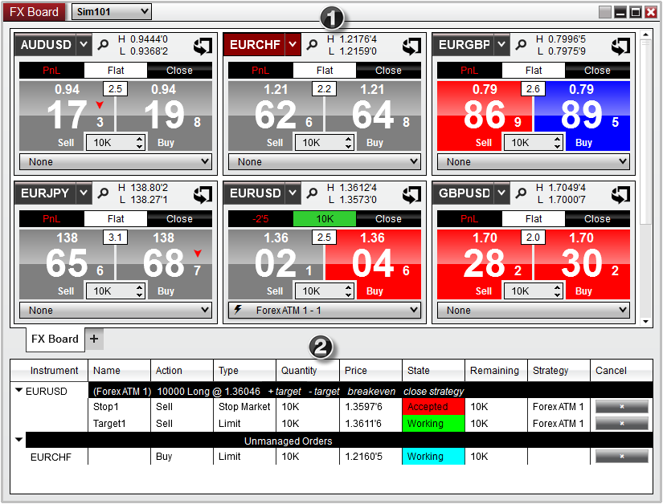


Operations > Order Entry > FX Board > Display Overview

Display Overview

| << [Click to Display Table of Contents](display_overview_fx_board.md) >> **Navigation:**     [Operations](operations.md) > [Order Entry](order_entry.md) > [FX Board](fx_board.md) > Display Overview | [Previous page](fx_board.md) [Return to chapter overview](fx_board.md) [Next page](working_with_instrument_tiles_fx_board.md) |
| --- | --- |

| playVideo |
| --- |
|  |
 
To open the FX Board window, select the New menu from the NinjaTrader Control Center. Then left mouse click on the menu item FX Board.
 
The FX Board is divided into two sections:
 
1.  Market Data Display
2.  Order Grid Display (optional)
 

   

Please see the sections below for more information on: Market Display and Order Grid
 

| Note: Positions and orders will only display for the selected Account and Instruments. |
| --- |
## 
        [Understanding the market data section](javascript:HMToggle('toggle','UnderstandingTheMarketDataSection','UnderstandingTheMarketDataSection_ICON'))

| Market Display The Market Display panel shows the inside bid and ask along with current position information.  Each tile will have two panels, representing the bid and ask price, where each respective panel will flash to represent when a tick has been received and the direction of the tick.   Market Display Definitions 1. The current spread between the best bid and best ask (the image below is showing a spread of 2.5 pips) 2. Position information 3. The handle of the current bid (current ask is on the right side of the spread) 4. The current bid 5. Sub pip value 6. The direction of the current tick (blue panel for an up tick, red panel for down tick) 7. The direction of the last tick received (blue arrow for an up tick, red arrow for down tick) 8. Current day high/low values   FXBoard_2   Instrument tiles also give you the ability to quickly place orders, or can be "flipped" to place custom orders.  Please see the section on [Submitting Orders](submitting_orders_fx_board.md) for more information. |
| --- |
        [Understanding the order grid section](javascript:HMToggle('toggle','UnderstandingTheOrderGridSection','UnderstandingTheOrderGridSection_ICON'))

| Order Grid Display The Order Grid displays active orders for the account and instrument tiles selected in the FX Board window.   FXBoard_3   Column Definitions   | Instrument | Name of the instrument | | --- | --- | | Name | Order name such as Stop1 or Target1 | | Action | Buy or Sell | | Type | Order type | | Quantity | Number of contracts submitted | | Price | Order price | | State | State of the order | | Remaining | Quantity remaining to be filled | | Strategy | Name of ATM Strategy associated with the order | | Cancel | Cancels the order(s) |        Order Grouping Orders that are submitted to the same instrument will be grouped together in the Order Grid and displayed in an aggregated view to consolidate these orders together.   1. Orders that are part of an ATM Strategy will be further aggregated by the ATM Strategy template name, as well as control specific to ATM Strategies (see the section on [Managing Positions](managing_positions_fx_board.md) for more information on these controls) 2. Orders that are not part of an ATM Strategy will be aggregated under the row heading name "Unmanaged Orders" indicating that there is no ATM Strategy associated with that particular order   Tip:  You can collapse orders under an instrument header by selecting the down arrow next to the instrument name.   FXBoard_27 |
| --- | --- | --- | --- | --- | --- | --- | --- | --- | --- | --- | --- | --- | --- | --- | --- | --- | --- | --- | --- | --- |
        [Understanding the right click menu](javascript:HMToggle('toggle','UnderstandingTheRightClickMenu','UnderstandingTheRightClickMenu_ICON'))

| The FX Board window has two right click menus, depending on where you click:   - Right clicking on the FX Board window itself will bring up menu items specific to the FX Board- Right clicking in the Order Grid will bring up menu items specific to orders   FX Board Control Right Click Menu Right clicking on the FX Board window itself will bring up a number of menu items specific to the FX Board    FXBoard_4     | Add Instrument(s) | Adds an individual instrument or list of instruments to the FX Board window | | --- | --- | | Create Instrument List... | Dynamically creates a list of all the current instruments in the FX Board window which can be accessed later | | Remove Tile | Removes the current selected instrument tile | | Quick order entry | Enables/Disables the ability to place quick orders from the Instrument tiles | | Send To | Loads the selected instrument into another NinjaTrader window | | Always On Top | Sets the FX Board window to always be on top of other windows | | Show Tabs | Sets if the window should allow for tabs | | Show Orders Grid | Enables/Disables the Orders Grid panel display | | Print | Displays Print options | | Share | Select to share via your share connections | | Properties | Configure the FX Board window properties |      Order Grid Control Right Click Menu Right clicking in an empty grid will bring up a number of general menu items specific to the Order Grid   FXBoard_6     | Cancel All Orders | Cancels all active orders on the current account | | --- | --- | | Show Orders Grid | Enables/Disables the Orders Grid panel display | | Export | Exports the grid contents to "CSV" or "Excel" file format | | Find... | Search for a term in the grid | | Print | Displays Print options | | Share | Select to share via your share connections | | Properties | Configure the FX Board Window's properties |      By moving your mouse cursor over an order and pressing down on your right mouse button, you will see a context menu listing all individual orders consolidated at the corresponding price and any relevant actions that you can perform on those orders.    FXBoard_5     | Cancel Order | Cancels the individual order selected | | --- | --- | | Increase Price | Increases the price of the order by one tenth-pip | | Decrease Price | Decreases the price of the order by one tenth-pip | | Cancel All Orders | Cancels all active orders on the current account | |
| --- | --- | --- | --- | --- | --- | --- | --- | --- | --- | --- | --- | --- | --- | --- | --- | --- | --- | --- | --- | --- | --- | --- | --- | --- | --- | --- | --- | --- | --- | --- | --- | --- | --- | --- | --- | --- | --- | --- | --- | --- | --- | --- | --- | --- |

