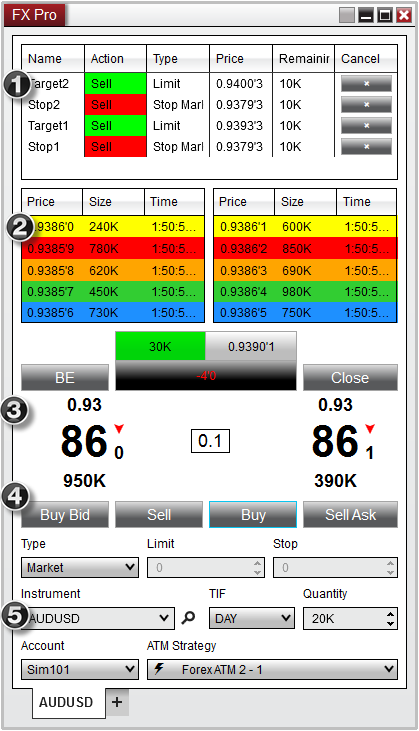

Operations \> Order Entry \> FX Pro \> Display Overview

Display Overview

| \<\< [Click to Display Table of Contents](display_overview_fx_pro.md) \>\> **Navigation:**     [Operations](operations-1.md) \> [Order Entry](order_entry-1.md) \> [FX Pro](fx_pro-1.md) \> Display Overview | [Previous page](fx_pro-1.md) [Return to chapter overview](fx_pro-1.md) [Next page](submitting_orders_fx_pro-1.md) |
| --- | --- |

To open the FX Pro window, select the New menu from the NinjaTrader Control Center. Then left mouse click on the menu item FX Pro.

 

The image below shows each of the 5 sections in the FX Pro window

 

1\. Order Grid

2\. Optional Level II panel

3\. Position and Level 1 (current inside market) display

4\. Action Buttons

5\. Order entry and ATM Strategy management

 

 

Please see the sections below for more information on each of these sections.

 

| Note: Positions and orders will only display for the selected Account and Instrument. |
| --- |

## 

        [Understanding the order grid section](javascript:HMToggle('toggle','UnderstandingTheOderGridSection','UnderstandingTheOderGridSection_ICON'))

| Order Grid Display The Order Grid displays active orders for the account and instrument selected in the Basic Entry window.   FXPro_1   Column Definitions   | Name | Order name such as Stop1 or Target1 | | --- | --- | | Action | Buy or Sell | | Type | Order type | | Price | Order price | | Remaining | Number of contracts/shares remaining to be filled | | Cancel | Cancels the order(s) | |
| --- | --- | --- | --- | --- | --- | --- | --- | --- | --- | --- | --- | --- |

        [Understanding the level II (market depth) section](javascript:HMToggle('toggle','UnderstandingTheLevelIIMarketDepthSection','UnderstandingTheLevelIIMarketDepthSection_ICON'))

| Level II (Market Depth) Display The Level II panel displays bid and ask market depth data color coded by price. The Level II display can be enabled/disabled by right mouse clicking inside the Level II display and selecting the menu item Show Level II.      | Note: the Level II panel that is displayed only for brokerages that support ECN style FX trading. If your brokerage does not support ECN FX then you will not see this panel on your FX Pro window. | | --- |        FXPro_2   Column Definitions   | Price | The bid or ask price. The bid data is shown in the left section and the ask in the right. | | --- | --- | | Size | The number of lots at that price level available to buy or sell (represented in short hand notation where K represents 1000\) | | Time | The last time the bid/ask was refreshed |      If a price is at a sub pip level, the sub\-pip value is displayed as a value after an apostrophe, as in the following example in which the sub\-pip value is highlighted in red.    Example: 1\.4115'5 (The price is at 1\.4115 pips plus 5 half pips)   Customizing the Number of Price Levels Displayed By default the Level II display in the FX Pro window will display five rows of market depth, however you can configure the Level II display to show additional rows by following the steps below:   1\.Right mouse click inside the FX Pro window2\.Select Properties 3\.Input the desire number of rows in the Number of price levels field4\.Press OK  FXPro_3       | Tip:  Depending on the size of your FX Pro window, the additional rows can potentially extend below the viewable range of the Level 2 display, at which point a scroll bar (1\) will appear to allow you to access those levels. You may optionally resize the Level 2 display by clicking on and dragging on the section splitter (2\) between the Order Grid and Level 2 display. | | --- | |
| --- | --- | --- | --- | --- | --- | --- | --- | --- |

        [Understanding the market display section](javascript:HMToggle('toggle','UnderstandingTheMarketDisplaySection','UnderstandingTheMarketDisplaySection_ICON')) 

| Market Display The Market Display panel shows the inside bid and ask along with current position information.   Market Display Definitions 1\.The current spread between the best bid and best ask (the image below is showing a spread of 2\.5 pips)2\.Position information3\.The handle of the current bid (current ask is on the right side of the spread)4\.The current bid5\.Tenth\-pip value. In the image below, the current bid is 0\.9401 and 0/10 of a pip displayed as 0\.9401'06\.Current volume (displayed as 100K when volume is not available)7\.The direction of the last tick (blue up arrow for an uptick, red down arrow for down tick)  FXPro_4       | Note:  FX brokerage technologies that do not support an ECN model will NOT display sub pips, nor will bid/ask volume be displayed. | | --- | |
| --- | --- |

        [Understanding the action buttons section](javascript:HMToggle('toggle','UnderstandingTheActionButtonsSection','UnderstandingTheActionButtonsSection_ICON')) 

| The FX Pro has several buttons which are used to invoke a number of order related actions.   FXPro_5     | BE (Break\-even) | Adjusts any open stop orders opposite of your position to the positions average entry price | | --- | --- | | Close | Closes the current position and cancel any working orders associated to the instrument/account combination. | | Buy Bid | Submits a Buy Limit order at the best bid price | | Sell | Submits a Sell order based on the current Order Controls configured | | Buy | Submits a Buy order based on the current Order Controls configured | | Sell Ask | Submits a Sell Limit order at the best ask price |      Please see the [Submitting Orders](submitting_orders_fx_pro-1.md) section for more information on using these buttons. |
| --- | --- | --- | --- | --- | --- | --- | --- | --- | --- | --- | --- | --- |

        [Understanding the order control section](javascript:HMToggle('toggle','UnderstandingTheOrderControlSection','UnderstandingTheOrderControlSection_ICON')) 

| Order Entry Controls The Order Control section of the FX Pro is used to specify several attributes for a pending order to be submitted.   FXPro_6     | Type | Selects the order Type to be submitted | | --- | --- | | Limit | Sets the order Limit price, if applicable | | Stop | Sets the order Stop Price, if applicable | | Instrument | Sets the Instrument | | TIF | Sets the order Time in Force | | Quantity | Sets the order Quantity | | Account | Sets the Account | | ATM Strategy | Selects the ATM Strategy | |
| --- | --- | --- | --- | --- | --- | --- | --- | --- | --- | --- | --- | --- | --- | --- | --- | --- |

        [Understanding the right click menu](javascript:HMToggle('toggle','UnderstandingTheRightClickMenu','UnderstandingTheRightClickMenu_ICON')) 

| The FX Pro window has two right click menus, depending on where you click:   •Right clicking on the FX Pro window itself will bring up menu items specific to the FX Pro•Right clicking in the Order Grid will bring up menu items specific to orders  FX Pro Control Right Click Menu Right clicking on the FX Pro window itself will bring up a number of menu items specific to the FX Pro   FXPro_9     | Auto Close Position | Automatically Closes the current instruments position at a specified time | | --- | --- | | OCO Order | Enables/Disables the OCO (one cancels other) function for a pending order | | Simulated Order | Enables/Disables the Simulated Order functionality for a pending order | | Cancel All Orders | Cancels all active orders on the current account | | Flatten Everything | Closes all open positions and cancels all open orders on every account associated with NinjaTrader | | Show Level II | Enables/Disables the Level II display panel | | Always On Top | Sets if the window should be always on top of other windows | | Show Tabs | Sets if the window should allow for tabs | | Print | Displays Print options | | Share | Select to share via your share connections | | Properties | Configure the [FX Pro window properties](properties_fx_pro-1.md) |      Order Grid Control Right Click Menu Right clicking in an empty grid will bring up a number of general menu items specific to the Order Grid   FXPro_7     | Cancel All Orders | Cancels all active orders on the current account | | --- | --- | | Export... | Exports the grid contents to "CSV" or "Excel" file format | | Find... | Search for a term in the grid | | Print | Displays Print options | | Share | Select to share via your share connections | | Properties | Configure the [FX Pro Window's properties](properties_fx_pro-1.md) |      By moving your mouse cursor over an order and pressing down on your right mouse button, you will see a context menu listing all individual orders consolidated at the corresponding price and any relevant actions that you can perform on those orders.     FXPro_8     | Cancel order | Cancels the individual order selected | | --- | --- | | Increase Price | Changes the price of the order \+1 tick | | Decrease Price | Changes the price of the order \-1 tick | | Cancel All Orders | Cancels all active orders on the current account | |
| --- | --- | --- | --- | --- | --- | --- | --- | --- | --- | --- | --- | --- | --- | --- | --- | --- | --- | --- | --- | --- | --- | --- | --- | --- | --- | --- | --- | --- | --- | --- | --- | --- | --- | --- | --- | --- | --- | --- | --- | --- | --- | --- |

