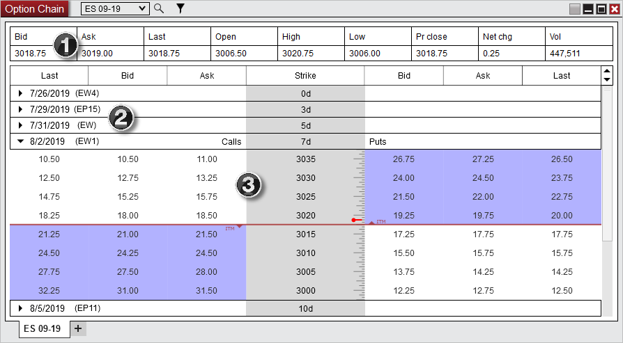



Operations \> Option Chain \> Display Overview

Display Overview

| \<\< [Click to Display Table of Contents](display_overview_option_chain.md) \>\> **Navigation:**     [Operations](operations-1.md) \> [Option Chain](option-chain-1.md) \> Display Overview | [Previous page](option-chain-1.md) [Return to chapter overview](option-chain-1.md) [Next page](submitting_orders_option_chain-1.md) |
| --- | --- |

To open the Option Chain Window, select the New menu from the NinjaTrader Control Center. Then left mouse click on the menu item Option Chain.

 

The image below shows the three sections in the of the Option Chain window:

 

 

1\) Quotes grid

2\) Ticker list

3\) Options quotes

 

        [Understanding the quotes grid section](javascript:HMToggle('toggle','Understandingtheunderlyingsecurityquotesgridsection','Understandingtheunderlyingsecurityquotesgridsection_ICON'))

| Quotes Grid The Quotes Grid displays current day quotes for the underlying security of the Option Chain window.   OptionsChain2   Column Definitions   | Bid | The bid price | | --- | --- | | Ask | The ask price | | Last | The last price | | Open | The daily open price | | High | The daily high price | | Low | The daily low price | | Pr close | The prior day close price | | Net chg | The net change since the prior day close in points | | Vol | The daily volume | |
| --- | --- | --- | --- | --- | --- | --- | --- | --- | --- | --- | --- | --- | --- | --- | --- | --- | --- | --- |

        [Understanding the ticker list section](javascript:HMToggle('toggle','Understandingthetickerlistsection','Understandingthetickerlistsection_ICON'))

| Ticker List The Ticker List displays the active options tickers for the selected underlying security in the Option Chain window.   OptionsChain3   1\) Expiration date 2\) Ticker name 3\) Days until expiration   Filtering Options Contracts With the filter button at the top of the window you can check or uncheck what tickers you want the Option Chain window to display.   OptionsChain4 |
| --- |

        [Understanding the option quotes grid section](javascript:HMToggle('toggle','Understandingtheoptionquotesgridsection','Understandingtheoptionquotesgridsection_ICON'))

| Option Quotes The Option Quotes displays calls and puts quotes for each strike price of the expanded options ticker in the Option Chain window.   OptionsChain5   1\) Columns display \- the last, bid, ask, and strike columns (additional columns can be added in the Properties) 2\) Calls \& Puts quotes \- call quotes are on the left and put quotes are on the right 3\) In The Money (ITM) options \- indicated by the shaded area the ITM triangle is pointing towards on the calls and puts section 4\) Last price for the underlying security \- indicated by the marker on top of the strike prices   Changing Sort Direction of Strike Prices Clicking on the Strike column header will change the sort direction of the strike prices. This can also be adjusted in the Properties.   OptionsChain6 |
| --- |

