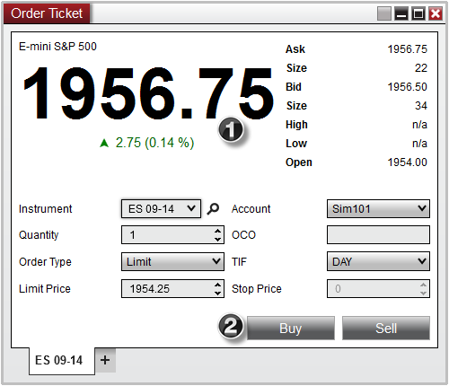


Operations > Order Entry > Order Ticket > Display Overview

Display Overview

| << [Click to Display Table of Contents](display_overview_order_ticket.md) >> **Navigation:**     [Operations](operations-1.md) > [Order Entry](order_entry-1.md) > [Order Ticket](order_ticket-1.md) > Display Overview | [Previous page](order_ticket-1.md) [Return to chapter overview](order_ticket-1.md) [Next page](submitting_orders_order_ticket-1.md) |
| --- | --- |
To open the Order Ticket Window, select the New menu from the NinjaTrader Control Center. Then left mouse click on the menu item Order Ticket.
 
The image below shows the two sections in the of the Order Ticket window:
 
1. Market Display
2. Order Entry
 

 

| Note: Positions and orders will only display for the selected Account and Instrument. |
| --- |
## 
        [Understanding the market display section](javascript:HMToggle('toggle','UnderstandingTheMarketDisplaySection','UnderstandingTheMarketDisplaySection_ICON'))

| Market Display The Order Ticket will display current market data information for the selected instrument.   Market Display Definitions 1.Instrument Description2.Last Price3.Current day net change4.Best ask price and ask size5.Best bid price and bid size6.Current day high, low, and open  OrderTicket_1 |
| --- |
        [Understanding the order control section](javascript:HMToggle('toggle','UnderstandingTheOrderControlSection','UnderstandingTheOrderControlSection_ICON'))

| Order Entry Controls The Order Control region of the Order Ticket is used to specify several attributes for a pending order to be submitted.   OrderTicket_2     | Instrument | Sets the Instrument | | --- | --- | | Account | Sets the Account | | Quantity | Sets the order Quantity | | OCO | Sets a user defined OCO ID | | Order Type | Sets the order type to be submitted | | TIF | Sets the Time in Force | | Limit Price | Sets the order Limit price | | Stop Price | Sets the order Stop price | | Buy | Submits an order to buy | | Sell | Submits an order to sell | |
| --- | --- | --- | --- | --- | --- | --- | --- | --- | --- | --- | --- | --- | --- | --- | --- | --- | --- | --- | --- | --- |
        [Understanding the right click menu](javascript:HMToggle('toggle','UnderstandingTheRightClickMenu','UnderstandingTheRightClickMenu_ICON'))

| Right Click Menu Right mouse click on the Order Ticket window to access the right click menu.   OrderTicket_4     | Always On Top | Sets if the window should be always on top of other windows | | --- | --- | | Show Tabs | Sets if the window should allow for tabs | | Print | Displays Print options | | Share | Displays Share options | | Properties | Sets the [Order Ticket properties](properties_order_ticket-1.md) | |
| --- | --- | --- | --- | --- | --- | --- | --- | --- | --- | --- |

