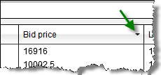

Operations > Market Analyzer > Dynamic Ranking and Sorting
Dynamic Ranking and Sorting
| << [Click to Display Table of Contents](dynamic_ranking_and_sorting.md) >> **Navigation:**     [Operations](operations-1.md) > [Market Analyzer](market_analyzer-1.md) > Dynamic Ranking and Sorting | [Previous page](working_with_columns-1.md) [Return to chapter overview](market_analyzer-1.md) [Next page](creating_cell_and_filter_condi-1.md) |
| --- | --- |
The Market Analyzer window can automatically rank and sort the data rows.
 
## How to Enable Automatic Ranking and Sorting
To enable ranking and sorting for a column:
 
1. To set the column you wish to sort press down on your left mouse button in the column header.  You can set the column to sort in either descending (down arrow) or ascending (up arrow) order.
 

 
2. You can enable dynamic sorting by pressing down on our right mouse button inside the Market Analyzer and selecting the menu Auto Sort.
 

 
3. You can set the auto sort interval within the Market Analyzer [Properties](market_analyzer_properties-1.md) window.

