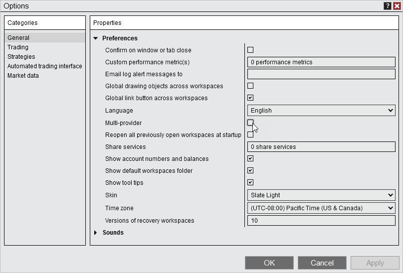

Configuration \> Options \> Enabling/Disabling Multi\-provider Mode

Enabling/Disabling Multi\-provider Mode

| \<\< [Click to Display Table of Contents](enabling_disabling-multi-provi.md) \>\> **Navigation:**     [Configuration](configuration-1.md) \> [Options](options-1.md) \> Enabling/Disabling Multi\-provider Mode | [Previous page](creating_your_own_skin-1.md) [Return to chapter overview](options-1.md) [Next page](options_trading-1.md) |
| --- | --- |

Multi\-provider mode can be enabled or disabled under Tools\> Options.

 

 

## Multi\-provider disabled

When logging in you will be presented with the Trading Mode window which will display the states of your Live and Simulation account. You will be able to select what account you want to connect to. Connecting to Live will only connect you to your live account, so that you don't trade to simulation in error. Connection to Simulation will connect you only to your simulation account, so you don't trade live in error. After you make a selection, you will be connected and taken to NinjaTrader. Optionally, you can connect to both Live and Simulation at the same time. To do so, after making your initial connection, you can select either Live or Simulation under the Connections menu.

 

Shadow strategies for local ATMs will be disabled since there is no local simulation account to send the orders to. Additionally, risk and commissions templates can't be applied to the playback connection, since they need to be applied to the local simulation account.

When Multi\-provider is disabled you can opt\-in to using Server side ATMs under Tools\> Options\> Strategies. See the [Server Side vs Local ATMs](server-side-vs-local-atms-1.md) section of the help guide to understand how they function differently. Server side ATMs cannot be used will connected to Playback.

 

## Multi\-provider enabled

When logging in you will be taken directly to NinjaTrader. You can connect to any configured connections under the Connections menu. Any connections set to Connect on start up will auto connect. Under Connections the configure button will be available to set up additional providers.

Local simulation accounts will always be available when Multi\-provider is enabled. A Global simulation mode will be available under Tools and is enabled by default to ensure trades are not made to live accounts in error.

 

| Warnings:  Configured Multi\-provider connections will be available to any user that connects to NinjaTrader on your local computer.   If you opted into using Server side ATMs (beta) and you then enable Multi\-provider mode, you will be switched to local ATMs. Server side ATMs are only available for the NinjaTrader connection. See the [Server Side vs Local ATMs](server-side-vs-local-atms-1.md) section of the help guide to understand how they function differently. |
| --- |

 

