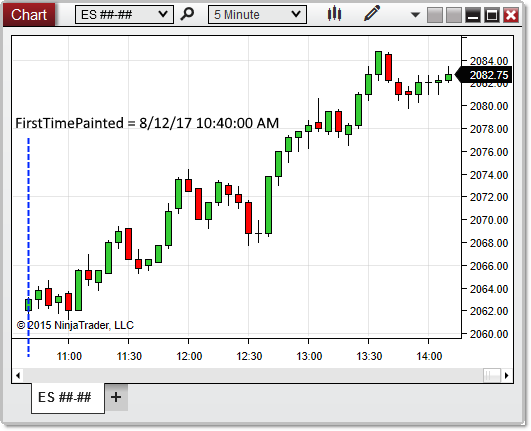



NinjaScript \> Language Reference \> Common \> Charts \> ChartControl \> FirstTimePainted

FirstTimePainted

| \<\< [Click to Display Table of Contents](firsttimepainted.md) \>\> **Navigation:**     [NinjaScript](ninjascript-1.md) \> [Language Reference](language_reference_wip-1.md) \> [Common](common-1.md) \> [Charts](chart-1.md) \> [ChartControl](chartcontrol-1.md) \> FirstTimePainted | [Previous page](crosshairtype-1.md) [Return to chapter overview](chartcontrol-1.md) [Next page](chartcontrol_getbarpaintwidth-1.md) |
| --- | --- |

## Definition

Indicates a DateTime value of the first bar painted on the chart. 

 

FirstTimePainted provides the timestamp of the first bar, NOT the time at which the bar was painted. For example, if a chart was opened and historical bars drawn on August 2nd at 5:00 pm, but the first bar on the chart is painted at a time\-axis value of July 31st at 1:00 am, then FirstTimePainted will return the July 31st date and time.

## 

## Property Value

A [DateTime](https://msdn.microsoft.com/en-us/library/system.datetime(v=vs.110).aspx) object containing information on the timestamp of the first bar of the chart.

## 

## Syntax

\<ChartControl\>.FirstTimePainted

## 

## Examples

| ns |
| --- |
| protected override void OnRender(ChartControl chartControl, ChartScale chartScale) {    // Draw text to display the first timestamp of a bar on the chart    Draw.Text(this, "firstTimeText", String.Format("The first bar of {0} is drawn at {1}", Instrument.MasterInstrument.Name, chartControl.FirstTimePainted), 1, High\[0],Brushes.Black); } |

 

 

In the image below, FirstTimePainted reveals that the first painted slot corresponds to 8/12/17 at 10:40:00 AM.

 

